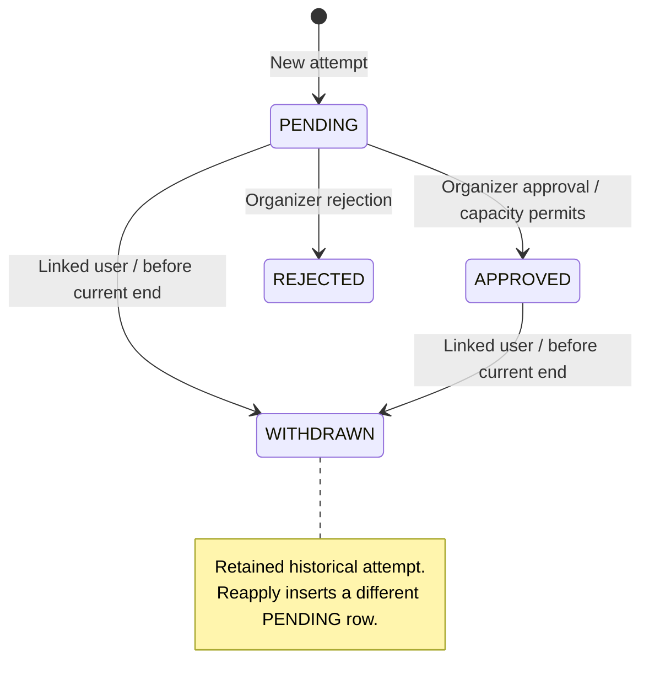

# Event Flow Domain Model

This is the authoritative description of the implemented domain semantics and
invariants. [PRODUCT.md](PRODUCT.md) describes user-facing capabilities; exact
storage definitions are in [prisma/schema.prisma](prisma/schema.prisma). Code
references below identify enforcement points. An intentional change to an
invariant must update this document with its implementation.

## 1. Identity

Email verification uses a single current, one-use delivery token per User in
the existing Verification table, addressed by the exact namespaced identifier
`event-flow:email-verification:<userId>`, with an independent row ID.
Only a SHA-256 digest of the delivery token is stored. A random nonce distinguishes
deliveries even when Better Auth issues identical JWTs within one second.
Delivery holds a User row lock and deletes/recreates this exact slot
transactionally; SMTP failure rolls back the replacement.
SMTP acceptance and database commit are not
a distributed transaction: a commit failure after acceptance can leave the newly
delivered link unusable, requiring resend.

The `/verify-email` before hook atomically deletes the matching, unexpired digest
before passing the original JWT to Better Auth for signature/expiry validation,
email confirmation, and automatic sign-in. Concurrent clicks have one winner;
revoked, consumed, expired, and legacy untracked links fail closed. A failure
after consumption requires resend. An already accepted verification request may
finish while a subsequent resend is in progress; resend cannot undo that request.
The one-hour expiry and contextual return destination remain unchanged.

Source: [verification delivery and consumption](lib/email-verification.ts),
[Better Auth hooks](lib/auth.ts).

`User` is the single Event Flow identity. `OrganizerProfile` is an optional,
one-per-User organizer capability. There is no GuestProfile,
AttendeeProfile, User.role, or isOrganizer domain field/entity.

Registration, sign-in, GET `/dashboard`, and GET `/onboarding/organizer` do not
create profiles. The verified-user `becomeOrganizer` action is the only current
activation path; `ensureOrganizerProfile` is idempotent through unique userId and
skipDuplicates. `/account` belongs to the User; `/dashboard` requires the
OrganizerProfile. REQUIRED registration requires a verified User, not a profile.

Sources: [activation](app/(application)/onboarding/organizer/actions.ts),
[organizer guard](features/organizer/server/require-organizer.ts),
[session guards](lib/session.ts).

## 2. Event workspace

`Event` and its `RegistrationForm`, fields, and options are mutable organizer
workspace. Event creation also creates an empty registration form. Workspace
edits increment contentVersion; version checks reject conflicting edits.
Unpublished changes are visible to the organizer and Preview, not public content.

Dates are stored as instants with an IANA timezone for input/display. Authoring
rejects ambiguous/nonexistent local DST times. Event end must be after start.

Sources: [create](features/events/create-event.ts),
[edit](features/events/update-event.ts),
[form mutations](features/events/server/registration-form.ts),
[date validation](features/events/event-input-schema.ts).

## 3. Publication

`publishOwnedEvent` locks the owned Event, checks the requested contentVersion,
builds a snapshot, creates a new EventRevision, and changes publishedRevisionId
atomically. Publishing the already-current contentVersion with a valid v2 snapshot succeeds without
creating another revision. A current v1 can republish to v2 at the same contentVersion. Older revisions are not rewritten by application code.

The first publication generates a separate UUIDv7 publicId via PostgreSQL
`uuidv7()` and assigns the first publishedAt. publicId is stored as `uuid`.
Republishing preserves them and the workspace updatedAt token. Revision numbers
increase per Event. A never-published Event has a null current pointer: create
Event first, create its revision second, set the pointer third. There is no
impossible insert cycle.

The composite FK `(Event.id, publishedRevisionId) -> EventRevision(eventId, id)`
ensures that the current publication belongs to the same Event. Its DELETE and
UPDATE actions are RESTRICT; it does not null or rewrite Event.id. Unpublish explicitly clears the nullable pointer while preserving publicId,
publishedAt, revisions, and Applications. Republish after Unpublish creates a new
revision even for the same contentVersion. Only (eventId, number) is unique across
publication attempts; (eventId, contentVersion) is no longer unique.

Sources: [publisher](features/events/server/publish-event.ts),
[public reader](features/events/server/get-published-event.ts).

## 4. Snapshot contracts

New snapshots have `schemaVersion: 2`; historical v1 remains readable and immutable. Responsibilities are separate:

| Contract | Responsibility | Implementation |
| --- | --- | --- |
| Current authoring | Validate mutable questions/options | [registrationFieldSchema](features/events/schemas/registration-form.ts) |
| Historical v1 | Read the frozen serialized format independently of authoring | [eventSnapshotSchema](features/events/schemas/event-snapshot.ts) |
| Current publication | Require valid v2 plus current authoring/publication rules | [eventPublicationSnapshotSchema](features/events/schemas/event-publication-snapshot.ts) |

V1 contains event content, schedule/timezone, visibility, account requirement,
capacity, registration dates, and ordered fields/options. Each field retains id,
type, label, description, required, and options; options retain id and label.
Array order expresses display order. Historical field constraints are defined
locally in the v1 parser, without runtime imports of mutable authoring validation.
Future authoring changes must not silently redefine that compatibility contract.

`buildEventSnapshot` constructs v2 from workspace and applies the current
publication validator, also for Preview. New publication forbids registration
opens/closes after event end. Historical v1 still reads older snapshots containing
a later close time; effective availability caps it at end.

Public Event, metadata, catalog, historical detail, prefill, and policy consumers
use validated historical snapshots. Invalid snapshots fail closed or produce an
unavailable state; they never fall back to mutable form/content.

## 5. Visibility

PUBLIC is reachable by direct URL and discoverable in `/e`. PRIVATE is reachable
by direct URL, excluded from `/e`, and marked noindex/nofollow. PRIVATE is not
password protection or an access-control boundary.

Catalog eligibility uses current snapshot.visibility and requires a publicId and
valid published revision. Upcoming means startsAt > now; Happening now means
startsAt <= now < endsAt; Past means endsAt <= now. Content and classification
never use workspace values. Organizer dashboard filters do use workspace visibility.

Sources: [catalog query](features/events/server/get-public-events.ts),
[catalog page](app/e/page.tsx), [Public Event](app/e/[publicId]/page.tsx).

## 6. Registration availability

The shared [registrationAvailability](features/events/registration-availability.ts)
uses:

```text
effectiveDeadline = min(registrationClosesAt, endsAt), if close is configured
                    endsAt, otherwise
now >= effectiveDeadline               => CLOSED
now < registrationOpensAt, if configured => NOT_OPEN_YET
otherwise                              => OPEN
```

Closed is checked before opening. startsAt does not close registration; event end
always does. UI computes at render time. Submit checks current published dates
under the Event lock and immediately before insert, using one PostgreSQL
decisionNow obtained after the lock. Persisted Event end/cancellation also guard admission.

## 7. Current policy vs historical form

**Submitted revision answers: "What did the applicant answer?"** It controls
fields, types, labels/options, required answers, answer validation, historical
meaning, and the saved Application.eventRevisionId. It must belong to the Event
resolved through publicId, but need not still be current for an ordinary submission.

**Current publication answers: "May this applicant submit now?"** It controls
registration availability, effective deadline, and accountRequirement. Ownership
is checked against the current Event -> OrganizerProfile -> User relation.

`submitEventApplication` resolves identity server-side, validates historical
answers, obtains Event FOR UPDATE, rereads publication and owner, then checks
current admission policy. New applications and nested answers/options are atomic.
The client cannot supply an authoritative userId or override a verified user's email.

For OPTIONAL -> REQUIRED, anonymous submission of an old OPTIONAL form fails;
a verified User may still submit it. For REQUIRED -> OPTIONAL, the old REQUIRED
flag does not itself block an anonymous submission. Other guards still apply.
Linked reapplication additionally requires the current form (section 12).

If Publish gets the lock first, Submit uses the new policy. If Submit gets it
first, it may commit under the old policy before Publish. Neither order changes
the submitted form contract.

Source: [submission](features/events/server/submit-application.ts).

## 8. Application

An Application is one historical submission attempt, not the person's mutable
registration record. Its submitted payload is eventRevisionId, fullName, email,
answers, and selected option IDs. Its lifecycle state is status, reviewedAt, and
withdrawnAt. userId is a nullable identity link, not a replacement for historical
name/email. Verified sessions supply userId/email; names remain applicant input.
Emails are trimmed and lowercased by submission code.

New attempts start PENDING. Review and withdrawal preserve payload and explicitly
preserve updatedAt; reviewedAt/withdrawnAt record those lifecycle changes. Removing
a linked User sets userId null while retaining submission data, provided other
User relations do not prevent that deletion.

Organizer All/status counts count Application rows, not distinct applicants.
Public Event selects the linked non-WITHDRAWN application first. If none exists,
it may show the latest withdrawn attempt for reapplication; it is not a full
history screen. Anonymous records are not selected by matching session email.

### My Registrations read model

The verified User workspace reads only `Application.userId = session.user.id`;
anonymous applications are never claimed through matching email. The overview
groups attempts by Event: the non-WITHDRAWN linked attempt is current (including
blocking REJECTED), otherwise the latest WITHDRAWN by createdAt DESC, id DESC is
selected. PRIVATE events and historical owner applications follow the same rules.
Cards use only validated current published snapshots and publicId. Missing or
invalid publication produces an unavailable card linking to registration history,
without workspace fallback. Historical answers
still belong to the submitted revision. Upcoming means endsAt > now (including
ongoing events), sorted by startsAt ASC; Past means endsAt <= now, sorted by
endsAt DESC. Both use publicId ASC as deterministic tie-breaker.

Registration detail at `/account/registrations/[eventId]` reads all attempts with
both `Application.userId = session.user.id` and the route Event ID. Malformed,
missing, and foreign IDs reveal no applications. Current selection is unchanged;
all other attempts appear newest-first by createdAt DESC, id DESC. Each attempt's
identity and answers retain their submitted meaning through its own validated
`EventRevision.snapshot`, using the shared historical answer interpreter. No
mutable form or email ownership is involved. PRIVATE linked events are included.
The page presents validated current published event content when available;
otherwise it uses the current attempt's validated submitted revision, or an
unavailable context if that snapshot is invalid. Neither path reads workspace
content. View event is shown only for a safe current publication/publicId.
The existing attendee SSE invalidation refreshes detail without new mutations.

Sources: [attendee overview](features/events/server/get-my-registrations.ts),
[attendee detail](features/events/server/get-my-registration.ts).

## 9. Application lifecycle



REJECTED is terminal and blocks another attempt for the same email/userId.
WITHDRAWN never transitions back to PENDING. Repeating withdrawal of an already
WITHDRAWN own application returns success without changing it only while the
Event lifecycle still permits application operations.
Review accepts only PENDING, writes reviewedAt, and uses a conditional update.
Approval creates Registration, PRIMARY Attendee and Ticket before EmailOutbox/NOTIFY in the same transaction;
rejection never creates Registration.
Withdrawal writes withdrawnAt and retains any previous reviewedAt. For an initially
APPROVED attempt, exactly one active Registration must be conditionally revoked
using the same decisionNow; any other count throws and rolls back withdrawal.

Sources: [review](features/events/server/review-application.ts),
[withdrawal](features/events/server/withdraw-application.ts).

## 10. Application uniqueness / attempts

PostgreSQL enforces partial unique indexes on `(eventId, email)` and
`(eventId, userId)` with this predicate:

```sql
WHERE status IN ('PENDING', 'APPROVED', 'REJECTED')
```

These three statuses are active **for uniqueness/current-attempt selection**.
REJECTED is blocking despite being terminal. WITHDRAWN is excluded; multiple
withdrawn attempts for one identity are permitted. Multiple null userId values
are allowed; anonymous attempts still participate in email uniqueness. SQL email
uniqueness is on stored text; normalization is a server responsibility.

Duplicate violations of either named index return the same success as a new
submission without exposing the existing record. They do not update or claim it.
This is identity-key uniqueness, not a guarantee about a physical person using
another email/account. There is no shared active-status helper; Public Event's
`not WITHDRAWN` currently matches the explicit SQL predicate for the current enum.

## 11. Capacity

Capacity comes from the current published snapshot; null means unlimited.
Only active Attendees (`revokedAt IS NULL`, through Registration/Event) occupy places, across all submitted
revisions of the Event. Application status counts remain review/history counts. Finite-capacity UI uses:

```text
filled = count(Attendee through Registration for Event where revokedAt IS NULL)
available = max(0, capacity - filled)
```

Submit and reapply may create PENDING even when full. Approve locks Event, reads
current capacity, counts active Attendees, and refuses approval when full.
APPROVED -> WITHDRAWN atomically revokes admission and releases a place. Publishing a lower capacity may make the
Event over capacity without demoting existing approvals. Later approvals remain
blocked until space exists. Concurrent approvals cannot independently take the
same final slot through the current server flow.

Sources: [review](features/events/server/review-application.ts),
[capacity UI](features/events/components/application-capacity.tsx).

## 12. Withdrawal and reapplication

The withdrawal action requires a verified User. The server finds the application
by id + Event + that userId, permits PENDING/APPROVED, and requires now < the
current published endsAt and persisted Event endsAt, with no cancellation. It does not use the submitted revision's end or the
registration close. REJECTED cannot be withdrawn. No payload/answers are deleted.

Reapply uses Submit and inserts a new PENDING attempt. Its later approval creates
a new Registration; the previous revoked Registration is never reactivated. For a verified User with
any prior WITHDRAWN attempt on that Event, the submitted revision must equal the
current pointer under lock. An intervening publication requires reloading the
form. Current admission/owner guards and partial uniqueness still apply.

Public Event chooses the latest withdrawn attempt by createdAt DESC, id DESC only
when no linked active attempt exists and the user is not the owner. Prefill uses
its fullName, current verified account email, and answers only when the field ID
and complete parsed field definition match. Options must retain their IDs, labels,
and order. Changed/deleted fields do not carry answers; new required fields must
be answered. Workspace option replacement can invalidate choice prefill even if
labels look unchanged. The previous attempt remains untouched.

There is no anonymous withdrawal/claiming extension. The extra current-revision
reapply check is keyed by verified userId, not anonymous email; ordinary anonymous
submission still follows section 7.

Sources: [Public Event](app/e/[publicId]/page.tsx),
[prefill](features/events/application-prefill.ts),
[withdraw action](features/events/withdraw-application-action.ts).

## 13. Historical answers

Application detail resolves labels/options exclusively through
`Application.eventRevision.snapshot`. fieldId/optionId are historical snapshot
identifiers, not foreign keys to mutable RegistrationField/RegistrationFieldOption.
Deleting or editing workspace questions cannot delete or reinterpret submitted
answers. Malformed/unresolvable historical data produces an unavailable state.
The same detail component serves the full page and modal.

Organizer header title/timezone may reflect workspace; that does not replace the
historical answer contract. Sources: [resolver](features/events/historical-answers.ts),
[detail](features/events/components/application-detail.tsx).

## 14. Ownership

Organizer routes/actions require a verified User and OrganizerProfile. Owned Event
lookups and mutations constrain organizerId server-side. Review verifies Event
ownership while taking the lock. Withdrawal verifies the application's linked
userId; knowledge of publicId or matching email alone is insufficient.

Authenticated Event owners cannot create a new application on their own Event:
Submit compares session.user.id with Event.organizer.userId before and after the
lock. Historical owner applications are not removed and may still be withdrawn
when eligible. OPTIONAL anonymous submissions cannot provide an absolute
physical-person owner guarantee.

## 15. Concurrency

Event is the serialization boundary for Publish, Submit, Approve, Reject, Withdraw,
and Reapply through Submit. These mutations use **ReadCommitted + explicit Event
FOR UPDATE**, not SERIALIZABLE. Publish/review share `lockEventForUpdate`;
Submit/Withdraw lock the same row using their public context. Form editing locks
Event before the form; Event updates explicitly lock Event, then check lifecycle
and their existing optimistic version conditions.

Review conditionally updates PENDING. Withdrawal conditionally updates own
PENDING/APPROVED. Unique indexes remain the final concurrent-insert protection.
If Approve precedes Withdraw, both may succeed and end WITHDRAWN. If Withdraw
precedes review, review refuses the non-PENDING row. Reject first blocks withdrawal;
Withdraw first prevents that rejection and allows a new attempt. Publish and
Approve use lock order to choose capacity; a later Publish can lower the limit.

Organizer application list/detail reads use RepeatableRead. Public reads are not
one multi-query transaction and can briefly be stale. Mutation guards remain
authoritative.

Sources: [lock helper](features/events/server/lock-event-for-update.ts),
[organizer reads](features/events/server/organizer-applications.ts).

## 16. Database invariants

PostgreSQL enforces the following independently of UI/server guards:

| Guarantee | Constraint/relation |
| --- | --- |
| Unique User email and one profile per User | User email and OrganizerProfile.userId unique indexes |
| Current revision belongs to its Event | Event `(id, publishedRevisionId)` -> EventRevision `(eventId, id)` |
| Submitted revision belongs to its Event | Application `(eventId, eventRevisionId)` -> EventRevision `(eventId, id)` |
| At most one active attempt per event/email or non-null userId | Partial indexes from section 10 |
| At most one answer per application/field | Unique `(applicationId, fieldId)` |
| No duplicate selected option within an answer | Primary key `(answerId, optionId)` |
| Unique publication identity/version | Event publicId and publishedRevisionId; EventRevision `(eventId, number)` |
| Unique form/order slots | RegistrationForm.eventId; field `(formId, position)`; option `(fieldId, position)` |

Foreign-key actions:

| Referencing -> referenced relation | ON DELETE | ON UPDATE |
| --- | --- | --- |
| OrganizerProfile -> User; Event -> OrganizerProfile | RESTRICT | CASCADE |
| Event current pointer -> EventRevision | RESTRICT | RESTRICT |
| EventRevision -> Event | RESTRICT | CASCADE |
| Application -> Event and composite EventRevision | RESTRICT | CASCADE |
| Application.userId -> User | SET NULL | CASCADE |
| Session / Account -> User | CASCADE | CASCADE |
| RegistrationForm -> Event; Field -> Form; Option -> Field | CASCADE | CASCADE |
| ApplicationAnswer -> Application; AnswerOption -> Answer | CASCADE | CASCADE |

Domain timestamps use timestamptz(3) on Event, EventRevision, registration workspace,
and Application. Auth tables and OrganizerProfile use timestamp(3) without time
zone. Answers/options have no timestamp columns. Internal primary keys, foreign
keys, and historical field/option references use PostgreSQL `uuid`, except for
the Better Auth infrastructure table Verification. Its ID remains text-compatible
to support Better Auth-owned identifiers; ordinary Prisma-created rows still get
the `uuid(7)` default. All other internal entity IDs remain native PostgreSQL UUID
with UUIDv7 generation. Our email-verification slot uses a namespaced identifier,
not its row ID. Provider `Account.accountId`/`providerId`, tokens,
and verification identifiers remain text. Snapshot v1 identifiers remain strings;
new snapshots contain UUIDs without changing the frozen historical parser.
Prisma manages internal generated IDs and updatedAt; these are not database-generated
defaults/triggers. The publisher explicitly generates publicId in PostgreSQL.

Server code, not DB CHECK constraints/triggers, enforces snapshot validity,
immutability of published/submitted content, lifecycle transitions, capacity,
current admission policy, verified identity, owner restrictions, explicit organizer
activation, and PUBLIC catalog filtering. Capacity safety depends on the shared
locking protocol; the DB does not impose an aggregate capacity constraint.

## 17. Application realtime

PostgreSQL and the existing server read models remain authoritative. SSE carries
only `connected` and `invalidate` events with empty JSON objects, plus comment
heartbeats; no application data, PII, or internal routing IDs reach the browser.
The client coalesces signals and calls `router.refresh()` without maintaining a
second application read model.

Submit/reapply, approve/reject, and withdrawal emit `pg_notify` inside the same
transaction after an actual write. Duplicate, no-op, and error paths do not emit.
The internal envelope contains only type, Event ID, and nullable linked User ID.
Anonymous submissions invalidate only organizer subscribers; linked changes also
invalidate that User's subscribers. Event editing/publication does not emit.

NOTIFY becomes visible only after successful commit; rollback delivers nothing.
Transactional NOTIFY or commit failure may roll back the entire mutation: this
is an accepted trade-off. After commit, listener/broker/SSE/browser failures do
not change the committed domain state. LISTEN/NOTIFY is ephemeral with no replay,
outbox, or durable event log. Initial LISTEN readiness and listener/browser
reconnection produce `connected`, prompting authoritative refresh to resync.

A lazy global singleton owns at most one dedicated LISTEN connection per Node
process/runtime context, separate from the Prisma pool. Each instance fans out
locally to authorized Event/User subscribers. Reconnect repeats LISTEN; the
broker retains no missed notifications. Slow streams are closed rather than
accumulating an unbounded queue.

Organizer streams require a verified User, OrganizerProfile, and owned Event;
malformed, foreign, and missing Event IDs share a neutral 404. Attendee routing
uses only the verified authoritative session User ID. Every request rechecks
authorization without refreshing the session. Stream lifetime is limited to
the earlier of 60 seconds from the session check and session expiry. Native
EventSource reconnect reauthorizes; an accepted revocation window of up to 60
seconds replaces session polling. Streams are private/no-store and heartbeat
approximately every 15 seconds. Abort, cancel, deadline, and failed writes remove
the subscriber and timers.

Deployment assumes persistent Node.js processes, session-preserving PostgreSQL
connections for LISTEN, and HTTP streaming without proxy buffering. Short-lived
serverless runtimes are not assumed to support this lifecycle. Broker dispose
is available without installing process signal handlers.

Sources: [emission](lib/realtime/application-notifications.ts),
[broker](lib/realtime/application-broker.ts),
[stream lifecycle](lib/realtime/sse-response.ts).

## 18. Transactional application email

Each committed new Application (including reapply) creates APPLICATION_RECEIVED
for its historical Application.email and NEW_APPLICATION for the organizer's
User.email. Actual PENDING -> APPROVED/REJECTED transitions create the matching
applicant notification. Mutation, EmailOutbox rows, and wake-up NOTIFY share the
same transaction. Duplicate/no-op/error paths create no delivery intent; rollback
removes both mutation and outbox. Withdrawal creates no email.

EmailOutbox has no Event/Application foreign keys. Its unique deduplicationKey is
Application.id + purpose. Recipient and versioned JSON payload are immutable
delivery snapshots (v1 contracts; APPLICATION_APPROVED additionally supports v2
with a Ticket reference, described below). They contain only the fields needed by that
email, not answers, rendered HTML/subject, or an absolute hostname. Separate Zod
contracts validate each type on creation and again before rendering. Received,
organizer, and approval emails snapshot the current published event under the
Event lock, never mutable workspace content. Render constructs absolute links
from the server app origin.

Rejection is deliberately independent of current publication/publicId. It uses
the submitted EventRevision's historical title when readable and the Event's
safe publicId when available. Otherwise it omits the title/link; the renderer
supports no CTA. Damaged historical JSON must not add a Reject precondition.
No rejection reason, workspace fallback, or new domain decision is introduced.

A short ReadCommitted transaction claims up to five due rows using a single
CTE SELECT FOR UPDATE SKIP LOCKED + UPDATE RETURNING. Due means PENDING with
nextAttemptAt <= DB now, or PROCESSING with a five-minute expired lease. Claim
sets lockedAt/lockedBy and increments attempts. Concurrent Node processes skip
each other's locks. SMTP starts only after commit, in parallel within the bounded
batch, with a 45-second socket-closing delivery deadline and shorter connection,
greeting, and idle timeouts. No domain or claim transaction spans SMTP.

Every success/retry/failure update predicates on id, PROCESSING, workerId, and
the claimed attempts value. Zero affected rows means lost ownership and causes
no further write. Attempts never reset. Failure after attempts 1/2/3/4 schedules
1 minute / 5 minutes / 30 minutes / 2 hours; attempt 5 becomes terminal FAILED
with nextAttemptAt null. An expired fifth claim also becomes FAILED under the
claim row lock without a sixth send. Retry clears locks; success writes SENT and
sentAt and clears due time, locks, and error. Errors are fixed bounded categories,
never raw SMTP responses, addresses, payloads, or credentials. SENT/FAILED are
excluded from automatic claims. An unacknowledged DB completion uses lease recovery.

Delivery is at-least-once, subject to the five-attempt limit: SMTP acceptance and
the SENT update are not atomic. Crash/lease recovery can duplicate a delivered
email. Ownership protects database state, not exactly-once SMTP delivery.

Next.js Node instrumentation starts a global/HMR-safe process singleton, with one
dispatcher loop and a dedicated LISTEN connection on event_flow_email_outbox,
separate from SSE. Startup, listener readiness/reconnect, and each 30-second sweep
query the durable queue. NOTIFY only wakes that loop; lost notifications cannot
lose intents. A running loop coalesces wake-ups. Disposal stops reconnect/timers,
closes the listener, and awaits in-flight delivery. The dispatcher makes no domain
decisions. Persistent Node runtimes remain required, as for realtime; there is
no separate Docker worker, generic bus, Redis, or leader election.

Sources: [creation](lib/email-outbox/enqueue.ts),
[contracts](lib/email-outbox/payload.ts), [delivery](lib/email-outbox/delivery.ts),
[dispatcher](lib/email-outbox/dispatcher.ts), [startup](instrumentation.ts).

## 19. Deliberate trade-offs

- EventRevision immutability is enforced by application code, not a DB trigger.
- Anonymous identity is weaker than authenticated identity. Anonymous submissions
  are not claimed by a User just because email matches.
- A full Event accepts PENDING attempts. Republish may lower capacity below the
  approved count while preserving approvals.
- Public UI can briefly be stale; authoritative mutations recheck conditions.

These are current boundaries, not a roadmap. The initial migration is a deliberate
pre-production development baseline; replacing applied migration history is not
a deployment strategy for a database containing persistent production data.


## 20. Event lifecycle

The axes remain independent: scheduled/cancelled lifecycle; published/unpublished
current pointer; snapshot PUBLIC/PRIVATE visibility; active/archived workspace.
There is no EventStatus enum or everPublished flag. Existence of EventRevision is
the publication-history source of truth. Revisions remain immutable in application
code and submitted Applications keep their original composite revision FK.

All lifecycle-sensitive mutations lock the same Event row first, then obtain
exactly one PostgreSQL clock_timestamp() as decisionNow. Decisions use OLD
persisted Event startsAt/endsAt before mutation: Upcoming before start, Ongoing
from start inclusive to end exclusive, Completed at/after end. Cancelled takes
precedence. Browser time never authorizes mutations. Existing public schedule and
visibility displays remain snapshot-based; persisted lifecycle guards are extra
restrictions, not permission to bypass current publication policy.

First Publish requires Upcoming; Republish requires Upcoming/Ongoing. Both refuse
cancelled/archived events. Unpublish permits any temporal phase unless cancelled
or archived. It clears only the current pointer; a subsequent permitted Publish
creates max(revision.number)+1. Repeated Publish while the same version remains
current is still a no-op after lifecycle validation.

Content/form editing refuses Completed/Cancelled/Archived. An Ongoing edit cannot
change startsAt and must retain endsAt > decisionNow. Optimistic edit/form version
checks remain. Submit/Reapply/Approve/Reject/Withdraw refuse cancellation or
persisted endsAt <= decisionNow before existing admission/status/capacity/identity
checks. Statuses, reviewedAt, withdrawnAt, and answers freeze; cancellation does
not transition Applications. Historical detail remains readable.

Cancel requires prior revision history and Upcoming/Ongoing, and is irreversible.
The owner supplies a trimmed 1–2000 character reason. A DB CHECK requires both
cancellation columns null, or a non-null cancellation date and a non-null reason
containing non-whitespace text. No mutation changes a saved cancellation reason.
Within the Event-locked transaction, Cancel updates the domain fact, selects
PENDING attempts and active Registrations, deduplicates normalized emails, validates frozen v1
EVENT_CANCELLED payloads and bulk inserts outbox intents via createMany. A single
outbox wake-up accompanies a nonempty batch. Each event/address has a unique
cancellation deduplication key. Applicant context is selected deterministically
from the newest affected attempt for that address. Current published context, or
last publication when unpublished, supplies email title/schedule/timezone; only a
valid current publication supplies a public CTA. Workspace content is not emailed.

Distinct linked affected userIds receive transactional applications.changed
notifications in one SQL statement with existing per-user payloads. Organizer
invalidation uses the same channel. The browser SSE contract and endpoints do not
change; no anonymous broadcast exists. Notification emission and durable outbox
commit atomically with cancellation; browser delivery itself is not durable.
Existing dispatcher/retry/at-least-once delivery semantics are unchanged.

Archive is owner-only for Completed/Cancelled; Restore clears archivedAt. Both
use the same lock/DB clock but never change public/attendee state or emit attendee
notifications. Archived workspaces are read-only apart from Restore. Delete
requires no revisions, no Applications or Registrations, null publicId/publishedAt/cancelledAt,
and an active workspace; existing form cascades remove owned draft structures.
Delete and Publish serialize on Event; publication history permanently disqualifies
hard deletion. Lifecycle, publication, and archive preserve the workspace edit
token; content writes continue to advance it.

## 21. Registration / granted admission

Application is the request/review/answers/attempt-history authority. Registration
is the approved-party, lifecycle and ownership authority, created only by approval (or historical
backfill of a proven approval). `revokedAt IS NULL` means active; a timestamp
means historical revoked admission. Event cancellation/completion and archive/restore
do not mutate Registration. Event lifecycle still independently gates actions.

Registration snapshots `Application.fullName/email/userId`, never current profile
identity. Email uses the existing submitted trim/lowercase semantics, without a
new normalization rule. User deletion sets userId null and preserves snapshots.
There is no email-based claiming.

DB enforcement: sourceApplicationId is globally unique; `(eventId, sourceApplicationId)`
references Application `(eventId, id)`. The inverse Application.registrations list
has actual cardinality 0..1. Event and source Application deletion are RESTRICT.
Partial unique indexes enforce one active registration per Event/non-null User
and per Event/email across linked and anonymous identities together; revoked rows
are excluded. CHECK requires revokedAt >= createdAt when revoked.

Every current APPROVED Application has exactly one active Registration through
the existing Event FOR UPDATE + ReadCommitted mutation protocol. Approve creates
admission with createdAt = reviewedAt = decisionNow before its outbox/NOTIFY.
Approved withdrawal updates Application, Registration and all active Attendees/Tickets atomically;
missing admission or Ticket is an invariant violation, not a successful withdrawal. PENDING withdrawal remains Application-only.
DB constraints or any thrown failure roll back the entire transaction.

The transactional migration rejects inconsistent timestamps, noncanonical email,
identity collisions and broken history references; it does not repair history.
APPROVED backfills active admission at reviewedAt. WITHDRAWN with reviewedAt and
withdrawnAt backfills revoked admission at those exact times. Other attempts have
no Registration. Correspondence is checked before commit. Application writers
must be stopped during migration and resumed only with the matching implementation.

Organizer Attendees reads only owned Event Attendees through Registration, with Active/Revoked
filters and identity/grant/revocation snapshots. The Attendees navigation badge
counts active Attendees, excluding revoked history. Application filters and counts
continue to count attempts. My Registrations and its detail preserve application
states/history and add admission context from linked Registrations. Public Event
confirms admission only from active Registration. Existing owner/User scoped SSE
refreshes these reads; no new protocol or payload is introduced. Cancellation
recipients are pending applicants plus active admissions, preserving normalized
email deduplication and existing linked-user invalidations.

## 22. Ticket / secure credential

`Attendee` is a concrete admitted person; `Ticket` is its immutable credential, with a
unique Attendee FK (`onDelete: Restrict`), UUIDv7 id, unique non-secret support
number, unique credential hash, encrypted credential, issuedAt and nullable
revokedAt. No Event id/status is duplicated: Event is reached through Attendee -> Registration.
DB CHECKs enforce revokedAt >= issuedAt and an all-null/all-present anonymous
hash/envelope pair. UNIQUE attendeeId gives cardinality 0..1; matching writers
and backfill ensure every PRIMARY has exactly one Ticket.

The QR bearer credential is `randomBytes(32)` encoded base64url (256 random bits).
SHA-256 is the deterministic lookup hash. AES-256-GCM with a random 96-bit IV and
128-bit authentication tag encrypts the secret for repeated display. The opaque
`v1.iv.ciphertext.tag` envelope authenticates Attendee id and secret purpose
as AAD. `TICKET_CREDENTIAL_ENCRYPTION_KEY` is a separate required canonical
base64url encoding of exactly 32 random bytes; never the Better Auth secret.
Loss/change of this key prevents existing Tickets from being displayed. Keys and
database backups must be retained securely together but stored separately.

QR payload is exactly `eventflow:ticket:v1:<credential>`, with no identity or IDs.
The server QR encoder generates SVG on render; no image is stored in the database
and no QR encoder is shipped to the client. The credential is never plaintext in
DB, Outbox, email, browser URLs, logs or SSE. Ticket numbers use readable random
characters, UNIQUE database enforcement and bounded savepoint retry on number
collision only. Numbers never authorize access.

**Capability issuance semantics:** explicitly only PRIMARY with userId null
creates a separate random 256-bit anonymous browser capability, stored as its own
SHA-256 hash and AES-GCM envelope. A linked PRIMARY gets neither field. GUEST gets no capability.
After issue, capability presence is historical Ticket data and is never
synchronized with later Registration.userId changes. User deletion keeps existing
ON DELETE SET NULL, preserves Registration/Ticket and their QR credential, creates
no capability, and removes authenticated browser access. It never converts a
historically linked Ticket to an anonymous Ticket. No email-based claiming exists.

Verified-session ownership protects `/account/registrations/[eventId]` and its
Ticket read model. `/ticket/<access-token>` needs no login and authorizes this Registration party by
anonymousAccessHash on a PRIMARY Ticket. Invalid/unknown tokens share an unavailable response. The
page exposes party Tickets/attendees/Event context (validated current publication,
or submitted snapshot when unavailable), not application answers or workspace.
It is request-time rendered, private/no-store, noindex/nofollow/noarchive and
no-referrer, without third-party resources. Application request logging excludes
capability routes. Deployment proxies/access logs must also redact `/ticket/*`;
Next's application logger cannot configure external infrastructure.

Approve holds the existing Event lock, obtains decisionNow, updates Application,
creates Registration, PRIMARY and Ticket, then enqueues approval email and NOTIFY in one
transaction. Ticket.issuedAt, PRIMARY.createdAt and Registration.createdAt equal decisionNow. Approved
withdrawal requires exactly one active Registration, PRIMARY and its Ticket, revokes the Registration and all active Attendees/Tickets at
one decisionNow and notifies in the same transaction. Any failure rolls back all
writes. Pending withdrawal has no Ticket. Reapply creates a new attempt and, on
approval, new Registration/PRIMARY/Ticket/number/secrets; old rows stay revoked.

Effective credential state for this iteration is: credential resolves AND Ticket
not revoked AND Attendee not revoked AND Registration not revoked AND Event not cancelled. Completed,
archived and unpublished are independent context, not new check-in rules.
No lifecycle command mutates Ticket history. Revoked/cancelled cards suppress QR;
completed cards retain history and can display QR with an Event completed notice.

APPLICATION_APPROVED v2 freezes applicant/Event email data and stores only ticketId
as the delivery reference. Rendering reads current Ticket/Registration/cancellation
state, decrypts only the anonymous access secret when needed, and constructs an
absolute CTA from BETTER_AUTH_URL. Linked CTA uses authenticated detail. Revoked
or cancelled state removes the Ticket CTA and explains the change. A User deleted
before delivery receives no authenticated or newly invented anonymous CTA. v1
payloads remain supported. Existing durable leases/retries/deduplication remain;
state is checked at rendering, not atomically with remote SMTP delivery, and Ticket
pages always recheck current state. No QR credential enters approval payloads.
Existing applications.changed routing and empty browser invalidation refresh
linked Ticket issue/revoke without a new protocol or anonymous stream.

Iteration 21A uses the controlled [Attendee rollout](docs/attendee-migration.md).
Preparation SQL, a table-locked Node data/crypto transaction, and final SQL are
separate steps with writers, old consumers and email dispatchers stopped throughout.
The Node step verifies history and hashes before backfilling PRIMARY, rebinds the
exact same QR/access secrets from Registration AAD to Attendee AAD using fresh IVs,
and verifies unchanged Ticket IDs/numbers/hashes/timestamps and Attendance history.
Production crypto accepts only Attendee context; no legacy fallback exists.
Repeated runs verify a completed no-op; ambiguous/partial states fail. Missing
historical Tickets are errors, never an instruction to regenerate credentials.
The old №19 Ticket backfill command is retired after this cutover.

## 23. Attendance / QR check-in

Attendance records a successful check-in, not admission eligibility. It has a
UUIDv7 id, UNIQUE required attendeeId, nullable ticketId, checkedInAt
timestamptz(3), nullable checkedInByUserId and method QR. There is no eventId;
Event is reached through Attendee -> Registration. The Attendee FK is RESTRICT. The
composite (attendeeId, ticketId) FK references Ticket (attendeeId, id)
with RESTRICT, and a DB CHECK requires ticketId for QR. User deletion SET NULLs
the actor; it does not remove the fact. No update/delete/revoke/undo writer exists.
The additive migration intentionally creates no historical Attendance.

The owner-only Server Action derives verified User and OrganizerProfile from the
authoritative session. Its only client fields are eventId and full qrPayload.
The server-only parser accepts exactly eventflow:ticket:v1:<credential>, using
the existing canonical 32-byte/43-character base64url secret validation. It does
not trim, normalize or accept alternate formats. SHA-256 credentialHash lookup
requires no decrypt. Invalid/unknown credentials return before an Event lock.

Candidate lookup is not authority. ReadCommitted transaction order is owned
Event FOR UPDATE, one DB clock_timestamp(), then authoritative Ticket by hash,
Attendee, Registration and Attendance reread. Foreign Event returns WRONG_EVENT without
identity, Ticket number or Event details. After matching the Event, checks are:
existing Attendance -> ALREADY_CHECKED_IN; cancellation -> EVENT_CANCELLED;
decisionNow < startsAt -> CHECK_IN_NOT_OPEN; decisionNow >= endsAt ->
CHECK_IN_CLOSED; any Registration/Attendee/Ticket revoked -> ADMISSION_REVOKED.
Otherwise insert Attendance with the same decisionNow, session actor and QR
method, then transactional attendance.changed NOTIFY. CHECKED_IN returns after
commit. Auth/unavailable and infrastructure failures are not INVALID_CREDENTIAL.
Publication/archive are not check-in guards. Existing Event locks serialize
scans with approved Withdraw, Cancel and schedule edits; UNIQUE attendeeId
is the final duplicate protection, with no generic idempotency or savepoint retry.

Attendance survives later Withdraw, admission/Ticket revoke, Event cancellation,
archive/restore and publication changes. Existing Attendance wins even over later
cancellation, closure or revocation; ALREADY_CHECKED_IN reports history and does
not grant a new entry. Withdraw/Cancel semantics are unchanged. Ticket validity
and QR visibility remain distinct from check-in eligibility.

attendance.changed shares event_flow_applications, the strict internal parser,
Event/User broker routing and existing SSE endpoints. Only INSERT emits; repeat,
error and no-op paths do not. Browser frames remain empty invalidations followed
by authoritative router.refresh(), with existing reconnect/session boundaries.
Operational counts include only currently active Attendees with Attendance
over all active Attendees; revoked attendance remains historical. Linked and
anonymous Ticket projections expose only checkedInAt, without extending access.

The client scanner uses qr-scanner with software decoding when native decoding
is unavailable, initially prefers an environment camera after user interaction,
and offers camera selection after permission. Switching cameras awaits the previous
scanner cleanup. After a decode, the camera/decoder stays active but further
decode results are ignored during processing and until explicit Scan next;
Scan next reopens the submission gate without restarting the camera. Stop scanner
and unmount release media/decoder. Stopping during a pending check-in releases the
camera without cancelling the request or allowing another before its result.
Explicit Stop clears the displayed result/error and suppresses the pending
response in the scanner UI; it does not undo a check-in on the server.
Switching cameras while a result is displayed preserves that result and gate.
It stores
no scanned secret. No raw payload, credential or hash enters Attendance, results,
errors or SSE. Next development Server Function argument logging is disabled via
logging.serverFunctions: false; existing Ticket/auth URL logging exclusions remain.
External infrastructure must not capture action request bodies containing secrets.

## 24. Attendee structural checkpoint (21A)

Registration is an approved party: it retains userId for ownership/routing and
createdAt/revokedAt for lifecycle. attendeeName/attendeeEmail remain transitional
PRIMARY snapshots. Attendee is a concrete admitted person and capacity seat, with
UUIDv7 id, Registration RESTRICT, optional User SET NULL, name, nullable email,
createdAt and nullable revokedAt (timestamptz(3)). CHECKs enforce revokedAt >=
createdAt and GUEST.userId IS NULL. Guest writers and published policy are defined in section 25.

A partial UNIQUE registrationId WHERE kind = PRIMARY applies across all history,
including revoked rows. Exactly one PRIMARY per Registration is established by
Approve, backfill and verification, without a trigger. PRIMARY copies the submitted
Application identity and decisionNow; its transitional Registration fields stay
synchronous. Registration.userId is party ownership; Attendee.userId is person
account association, conceptually distinct even though equal today. Deleting User
SET NULLs both without inventing anonymous capabilities or rewriting snapshots.

Approve is Event lock -> DB decisionNow -> guards/active Attendee capacity ->
Application approval -> Registration -> PRIMARY -> Ticket -> Outbox -> NOTIFY ->
commit. Any failure rolls back all writes. Approved Withdraw verifies PRIMARY and
Ticket correspondence and revokes the whole active party at the same decisionNow; Attendance
is untouched. It selects PRIMARY by kind, not by assuming no future other people.
Reapply never resurrects old Registration/PRIMARY/Ticket/Attendance history.

Person rows, scanner identity (nullable email), Tickets, attendance and seat counts
come from Attendee. Detail projects Registration -> PRIMARY/GUEST -> Ticket/Attendance.
Applications, answers, attempts, ownership, cancellation recipients and account
lists remain Registration/Application based. Registration.userId continues to
route realtime notifications; applications.changed and attendance.changed and the
SSE protocol are unchanged. Anonymous PRIMARY access now authorizes this party’s view and Guest management
with the same token and URL.
Active Registration count equals active PRIMARY count; Guests add further capacity seats.
The structural checkpoint is extended by iteration 21B below.

## 25. Guests and party management (21B)

Registration.userId is linked party ownership, verified against the authoritative
session; PRIMARY is the party owner’s admitted person. GUEST has userId null,
a trimmed name (1–200), and an optional trimmed/lowercase validated email contact
snapshot (empty becomes null). No email uniqueness or User lookup applies.

Event.maxGuestsPerRegistration is draft authority: NOT NULL DEFAULT 0, CHECK 0–10.
Only current published snapshot policy authorizes Add. Frozen v1 parsing is
unchanged and implies effective limit 0; v2 requires the explicit field. New
Publish/Preview use v2. Historical EventRevision JSON is never rewritten. Lowering
the limit, including to zero, preserves all existing guests and Tickets.

Both mutations authorize before and again after Event FOR UPDATE, then use its
single post-lock DB decisionNow. Linked authorization compares Registration.userId;
anonymous authorization validates the canonical existing access token, hashes it,
and resolves Ticket -> PRIMARY -> this Registration. Guest Tickets, QR credentials,
support numbers and client IDs grant no management authority. Capability presence
remains historical issuance data, not inferred from a later null userId. The same
PRIMARY capability can read revoked history; mutations require active Registration
and PRIMARY/Ticket. It grants no account identity or whole-party withdrawal.

Add/Remove require no cancellation and decisionNow < persisted Event.startsAt.
Add additionally requires valid current publication, active GUEST count below its
limit, and active Attendee count below published snapshot.capacity (null unlimited).
Remove does not require publication or guest permission. It only targets a GUEST
of the authorized Registration, revokes Guest and Ticket at one decisionNow, and
never deletes or changes Attendance. A consistent already-revoked Guest is a no-op;
partial Guest/Ticket state fails. Lifecycle guards still apply to repeated requests.
Unknown/foreign parties, capabilities and targets return neutral UNAVAILABLE.

Add creates GUEST and its normal Ticket atomically at decisionNow using existing
Attendee AAD, credential and QR protocol. GUEST never gets an anonymous capability.
Ticket failure rolls back the Guest. Event locking serializes guest limit/capacity
with Approve, publication, Withdraw and Cancel, without mutable seat counters.
Approved Withdraw retains PRIMARY correspondence validation and its previous
lifecycle rules, revoking all active party people/Tickets at one decisionNow while
preserving prior revocations and Attendance. Reapply never copies old Guests.

Linked detail and the existing anonymous PRIMARY URL project all party Tickets
through safe TicketPresentation before JSX. Revoked/cancelled QR suppression stays
unchanged. Account lists remain party-based; organizer Attendees and scanner show
kind, and organizer Guest rows name their PRIMARY. Successful Add/Remove emit
transactional attendees.changed with only eventId and nullable Registration.userId.
The existing broker/SSE invalidates Event and linked account views; anonymous pages
refresh after mutation without SSE. No-op Remove emits nothing. Guest operations
send no email; cancellation recipients remain Registration/PRIMARY-owner based.
