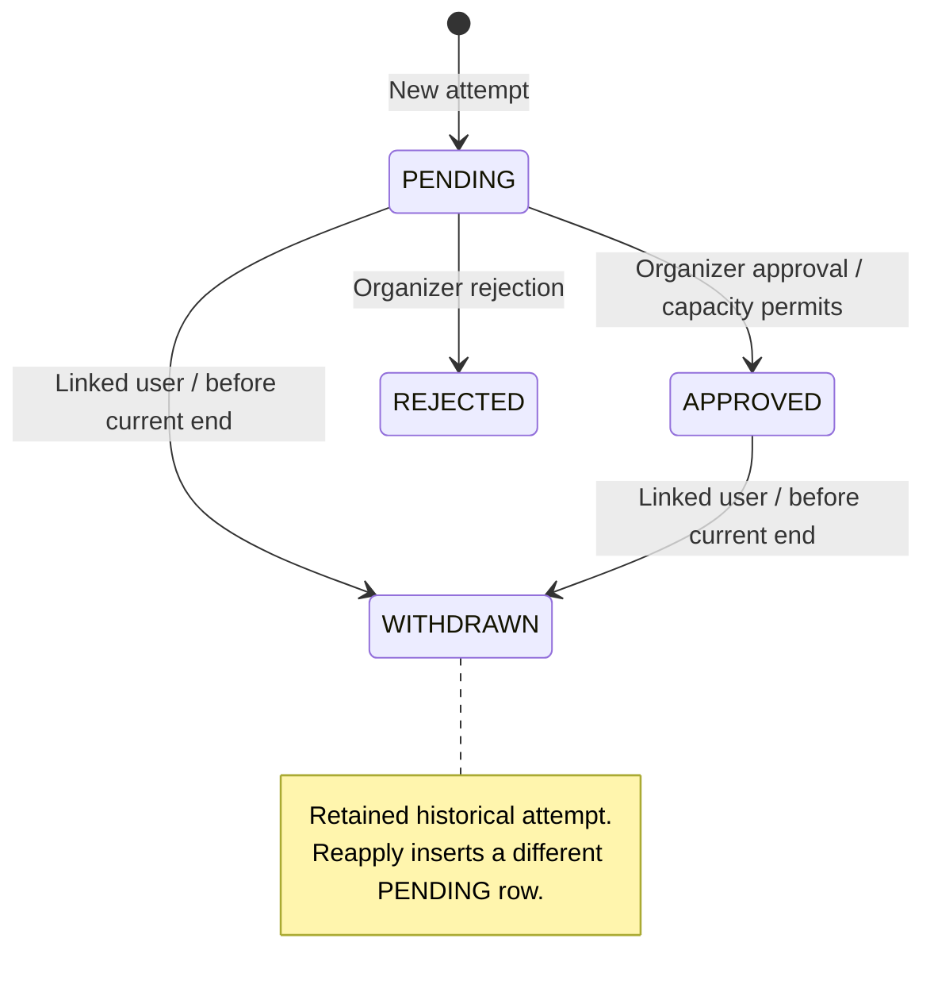

# Event Flow Domain Model

This is the authoritative description of the implemented domain semantics and
invariants. [PRODUCT.md](PRODUCT.md) describes user-facing capabilities; exact
storage definitions are in [prisma/schema.prisma](prisma/schema.prisma). Code
references below identify enforcement points. An intentional change to an
invariant must update this document with its implementation.

## 1. Identity

Email verification uses a single current, one-use delivery token per User in
the existing Verification table, addressed by the exact namespaced identifier
`event-flow:email-verification:<userId>`, with an independent row ID.
Only a SHA-256 digest of the delivery token is stored. A random nonce distinguishes
deliveries even when Better Auth issues identical JWTs within one second.
Delivery holds a User row lock and deletes/recreates this exact slot
transactionally; SMTP failure rolls back the replacement.
SMTP acceptance and database commit are not
a distributed transaction: a commit failure after acceptance can leave the newly
delivered link unusable, requiring resend.

The `/verify-email` before hook atomically deletes the matching, unexpired digest
before passing the original JWT to Better Auth for signature/expiry validation,
email confirmation, and automatic sign-in. Concurrent clicks have one winner;
revoked, consumed, expired, and legacy untracked links fail closed. A failure
after consumption requires resend. An already accepted verification request may
finish while a subsequent resend is in progress; resend cannot undo that request.
The one-hour expiry and contextual return destination remain unchanged.

Source: [verification delivery and consumption](lib/email-verification.ts),
[Better Auth hooks](lib/auth.ts).

`User` is the single Event Flow identity. `OrganizerProfile` is an optional,
one-per-User organizer capability. There is no GuestProfile,
AttendeeProfile, User.role, or isOrganizer domain field/entity.

Registration, sign-in, GET `/dashboard`, and GET `/onboarding/organizer` do not
create profiles. The verified-user `becomeOrganizer` action is the only current
activation path; `ensureOrganizerProfile` is idempotent through unique userId and
skipDuplicates. `/account` belongs to the User; `/dashboard` requires the
OrganizerProfile. REQUIRED registration requires a verified User, not a profile.

Sources: [activation](app/(application)/onboarding/organizer/actions.ts),
[organizer guard](features/organizer/server/require-organizer.ts),
[session guards](lib/session.ts).

## 2. Event workspace

`Event` and its `RegistrationForm`, fields, and options are mutable organizer
workspace. Manual Event creation also creates an empty registration form; template creation
atomically initializes it from validated configuration (section 31). Workspace
edits increment contentVersion; version checks reject conflicting edits.
Unpublished changes are visible to the organizer and Preview, not public content.

Dates are stored as instants with an IANA timezone for input/display. Authoring
rejects ambiguous/nonexistent edited local DST times. Event end must be after start.
Minute-resolution Event Edit preserves untouched dates, including nullable registration
boundaries, from the locked authoritative Event row with exact seconds/milliseconds.
Client edit markers never supply preserved timestamps; changed local values or timezone
are also detected against the stored row. A timezone edit reinterprets local dates in
the new zone, except the immutable Ongoing start, whose exact instant only changes
its display zone. Existing lifecycle/version/contentVersion guards remain unchanged.
Local HTML min/max are UX hints: import review omits cross-field wall-clock bounds,
and Edit omits a conflicting hint when its authoritative-source absolute interval is
valid across a DST fold. The shared absolute relationship validation remains authority.

Sources: [create](features/events/create-event.ts),
[edit](features/events/update-event.ts),
[form mutations](features/events/server/registration-form.ts),
[date validation](features/events/event-input-schema.ts).

## 3. Publication

`publishOwnedEvent` locks the owned Event, checks the requested contentVersion,
builds a snapshot, creates a new EventRevision, and changes publishedRevisionId
atomically. Publishing the already-current contentVersion with a valid v2 snapshot succeeds without
creating another revision. A current v1 can republish to v2 at the same contentVersion. Older revisions are not rewritten by application code.

The first publication generates a separate UUIDv7 publicId via PostgreSQL
`uuidv7()` and assigns the first publishedAt. publicId is stored as `uuid`.
Republishing preserves them and the workspace updatedAt token. Revision numbers
increase per Event. A never-published Event has a null current pointer: create
Event first, create its revision second, set the pointer third. There is no
impossible insert cycle.

The composite FK `(Event.id, publishedRevisionId) -> EventRevision(eventId, id)`
ensures that the current publication belongs to the same Event. Its DELETE and
UPDATE actions are RESTRICT; it does not null or rewrite Event.id. Unpublish explicitly clears the nullable pointer while preserving publicId,
publishedAt, revisions, and Applications. Republish after Unpublish creates a new
revision even for the same contentVersion. Only (eventId, number) is unique across
publication attempts; (eventId, contentVersion) is no longer unique.

Sources: [publisher](features/events/server/publish-event.ts),
[public reader](features/events/server/get-published-event.ts).

## 4. Snapshot contracts

New snapshots have `schemaVersion: 2`; historical v1 remains readable and immutable. Responsibilities are separate:

| Contract | Responsibility | Implementation |
| --- | --- | --- |
| Current authoring | Validate mutable questions/options | [registrationFieldSchema](features/events/schemas/registration-form.ts) |
| Historical v1 | Read the frozen serialized format independently of authoring | [eventSnapshotSchema](features/events/schemas/event-snapshot.ts) |
| Current publication | Require valid v2 plus current authoring/publication rules | [eventPublicationSnapshotSchema](features/events/schemas/event-publication-snapshot.ts) |

V1 contains event content, schedule/timezone, visibility, account requirement,
capacity, registration dates, and ordered fields/options. Each field retains id,
type, label, description, required, and options; options retain id and label.
Array order expresses display order. Historical field constraints are defined
locally in the v1 parser, without runtime imports of mutable authoring validation.
Future authoring changes must not silently redefine that compatibility contract.

`buildEventSnapshot` constructs v2 from workspace and applies the current
publication validator, also for Preview. New publication forbids registration
opens/closes after event end. Historical v1 still reads older snapshots containing
a later close time; effective availability caps it at end.

Public Event, metadata, catalog, historical detail, prefill, and policy consumers
use validated historical snapshots. Invalid snapshots fail closed or produce an
unavailable state; they never fall back to mutable form/content.

## 5. Visibility

PUBLIC is reachable by direct URL and discoverable in `/e`. PRIVATE is reachable
by direct URL, excluded from `/e`, and marked noindex/nofollow. PRIVATE is not
password protection or an access-control boundary.

Catalog eligibility uses current snapshot.visibility and requires a publicId and
valid published revision. Upcoming means startsAt > now; Happening now means
startsAt <= now < endsAt; Past means endsAt <= now. Content and classification
never use workspace values. Organizer dashboard filters do use workspace visibility.

Sources: [catalog query](features/events/server/get-public-events.ts),
[catalog page](app/e/page.tsx), [Public Event](app/e/[publicId]/page.tsx).

## 6. Registration availability

The shared [registrationAvailability](features/events/registration-availability.ts)
uses:

```text
effectiveDeadline = min(registrationClosesAt, endsAt), if close is configured
                    endsAt, otherwise
now >= effectiveDeadline               => CLOSED
now < registrationOpensAt, if configured => NOT_OPEN_YET
otherwise                              => OPEN
```

Closed is checked before opening. startsAt does not close registration; event end
always does. UI computes at render time. Submit checks current published dates
under the Event lock and immediately before insert, using one PostgreSQL
decisionNow obtained after the lock. Persisted Event end/cancellation also guard admission.

## 7. Current policy vs historical form

**Submitted revision answers: "What did the applicant answer?"** It controls
fields, types, labels/options, required answers, answer validation, historical
meaning, and the saved Application.eventRevisionId. It must belong to the Event
resolved through publicId, but need not still be current for an ordinary submission.

**Current publication answers: "May this applicant submit now?"** It controls
registration availability, effective deadline, and accountRequirement. Ownership
is checked against the current Event -> OrganizerProfile -> User relation.

`submitEventApplication` resolves identity server-side, validates historical
answers, obtains Event FOR UPDATE, rereads publication and owner, then checks
current admission policy. New applications and nested answers/options are atomic.
The client cannot supply an authoritative userId or override a verified user's email.

For OPTIONAL -> REQUIRED, anonymous submission of an old OPTIONAL form fails;
a verified User may still submit it. For REQUIRED -> OPTIONAL, the old REQUIRED
flag does not itself block an anonymous submission. Other guards still apply.
Linked reapplication additionally requires the current form (section 12).

If Publish gets the lock first, Submit uses the new policy. If Submit gets it
first, it may commit under the old policy before Publish. Neither order changes
the submitted form contract.

Source: [submission](features/events/server/submit-application.ts).

## 8. Application

An Application is one historical submission attempt, not the person's mutable
registration record. Its submitted payload is eventRevisionId, fullName, email,
answers, and selected option IDs. Its lifecycle state is status, reviewedAt, reviewedByUserId, and
withdrawnAt. userId is a nullable identity link, not a replacement for historical
name/email. Verified sessions supply userId/email; names remain applicant input.
Emails are trimmed and lowercased by submission code.

New attempts start PENDING. Review and withdrawal preserve payload and explicitly
preserve updatedAt; reviewedAt/withdrawnAt record those lifecycle changes. Removing
a linked User sets userId null while retaining submission data, provided other
User relations do not prevent that deletion.

Organizer All/status counts count Application rows, not distinct applicants.
Public Event selects the linked non-WITHDRAWN application first. If none exists,
it may show the latest withdrawn attempt for reapplication; it is not a full
history screen. Anonymous records are not selected by matching session email.

### My Registrations read model

The verified User workspace reads only `Application.userId = session.user.id`;
anonymous applications are never claimed through matching email. The overview
groups attempts by Event: the non-WITHDRAWN linked attempt is current (including
blocking REJECTED), otherwise the latest WITHDRAWN by createdAt DESC, id DESC is
selected. PRIVATE events and historical owner applications follow the same rules.
Cards use only validated current published snapshots and publicId. Missing or
invalid publication produces an unavailable card linking to registration history,
without workspace fallback. Historical answers
still belong to the submitted revision. Upcoming means endsAt > now (including
ongoing events), sorted by startsAt ASC; Past means endsAt <= now, sorted by
endsAt DESC. Both use publicId ASC as deterministic tie-breaker.

Registration detail at `/account/registrations/[eventId]` reads all attempts with
both `Application.userId = session.user.id` and the route Event ID. Malformed,
missing, and foreign IDs reveal no applications. Current selection is unchanged;
all other attempts appear newest-first by createdAt DESC, id DESC. Each attempt's
identity and answers retain their submitted meaning through its own validated
`EventRevision.snapshot`, using the shared historical answer interpreter. No
mutable form or email ownership is involved. PRIVATE linked events are included.
The page presents validated current published event content when available;
otherwise it uses the current attempt's validated submitted revision, or an
unavailable context if that snapshot is invalid. Neither path reads workspace
content. View event is shown only for a safe current publication/publicId.
The existing attendee SSE invalidation refreshes detail without new mutations.

Sources: [attendee overview](features/events/server/get-my-registrations.ts),
[attendee detail](features/events/server/get-my-registration.ts).

## 9. Application lifecycle



REJECTED is terminal and blocks another attempt for the same email/userId.
WITHDRAWN never transitions back to PENDING. Repeating withdrawal of an already
WITHDRAWN own application returns success without changing it only while the
Event lifecycle still permits application operations.
Review accepts only PENDING, writes reviewedAt/reviewedByUserId, and uses a conditional update.
Approval creates Registration, PRIMARY Attendee and Ticket before EmailOutbox/NOTIFY in the same transaction;
rejection never creates Registration.
Withdrawal writes withdrawnAt and retains previous reviewedAt/reviewedByUserId. For an initially
APPROVED attempt, exactly one active Registration must be conditionally revoked
using the same decisionNow; any other count throws and rolls back withdrawal.

Sources: [review](features/events/server/review-application.ts),
[withdrawal](features/events/server/withdraw-application.ts).

## 10. Application uniqueness / attempts

PostgreSQL enforces partial unique indexes on `(eventId, email)` and
`(eventId, userId)` with this predicate:

```sql
WHERE status IN ('PENDING', 'APPROVED', 'REJECTED')
```

These three statuses are active **for uniqueness/current-attempt selection**.
REJECTED is blocking despite being terminal. WITHDRAWN is excluded; multiple
withdrawn attempts for one identity are permitted. Multiple null userId values
are allowed; anonymous attempts still participate in email uniqueness. SQL email
uniqueness is on stored text; normalization is a server responsibility.

Duplicate violations of either named index return the same success as a new
submission without exposing the existing record. They do not update or claim it.
This is identity-key uniqueness, not a guarantee about a physical person using
another email/account. There is no shared active-status helper; Public Event's
`not WITHDRAWN` currently matches the explicit SQL predicate for the current enum.

## 11. Capacity

Capacity comes from the current published snapshot; null means unlimited.
Only active Attendees (`revokedAt IS NULL`, through Registration/Event) occupy places, across all submitted
revisions of the Event. Application status counts remain review/history counts. Finite-capacity UI uses:

```text
filled = count(Attendee through Registration for Event where revokedAt IS NULL)
available = max(0, capacity - filled)
```

Submit and reapply may create PENDING even when full. Approve locks Event, reads
current capacity, counts active Attendees, and refuses approval when full.
APPROVED -> WITHDRAWN atomically revokes admission and releases a place. Publishing a lower capacity may make the
Event over capacity without demoting existing approvals. Later approvals remain
blocked until space exists. Concurrent approvals cannot independently take the
same final slot through the current server flow.

Sources: [review](features/events/server/review-application.ts),
[capacity UI](features/events/components/event-capacity.tsx).

## 12. Withdrawal and reapplication

The withdrawal action requires a verified User. The server finds the application
by id + Event + that userId, permits PENDING/APPROVED, and requires now < the
current published endsAt and persisted Event endsAt, with no cancellation. It does not use the submitted revision's end or the
registration close. REJECTED cannot be withdrawn. No payload/answers are deleted.

Reapply uses Submit and inserts a new PENDING attempt. Its later approval creates
a new Registration; the previous revoked Registration is never reactivated. For a verified User with
any prior WITHDRAWN attempt on that Event, the submitted revision must equal the
current pointer under lock. An intervening publication requires reloading the
form. Current admission/owner guards and partial uniqueness still apply.

Public Event chooses the latest withdrawn attempt by createdAt DESC, id DESC only
when no linked active attempt exists and the user is not the owner. Prefill uses
its fullName, current verified account email, and answers only when the field ID
and complete parsed field definition match. Options must retain their IDs, labels,
and order. Changed/deleted fields do not carry answers; new required fields must
be answered. Workspace option replacement can invalidate choice prefill even if
labels look unchanged. The previous attempt remains untouched.

There is no anonymous withdrawal/claiming extension. The extra current-revision
reapply check is keyed by verified userId, not anonymous email; ordinary anonymous
submission still follows section 7.

Sources: [Public Event](app/e/[publicId]/page.tsx),
[prefill](features/events/application-prefill.ts),
[withdraw action](features/events/withdraw-application-action.ts).

## 13. Historical answers

Application detail resolves labels/options exclusively through
`Application.eventRevision.snapshot`. fieldId/optionId are historical snapshot
identifiers, not foreign keys to mutable RegistrationField/RegistrationFieldOption.
Deleting or editing workspace questions cannot delete or reinterpret submitted
answers. Malformed/unresolvable historical data produces an unavailable state.
The same detail component serves the full page and modal.

Organizer header title/timezone may reflect workspace; that does not replace the
historical answer contract. Sources: [resolver](features/events/historical-answers.ts),
[detail](features/events/components/application-detail.tsx).

## 14. Ownership

Owner authoring/lifecycle routes and actions require a verified User and OrganizerProfile.
Operational routes authorize the verified User as owner or EventStaff through the fixed
server-only permission boundary. Review rechecks permission after the Event lock.
Withdrawal verifies the application's linked
userId; knowledge of publicId or matching email alone is insufficient.

Authenticated Event owners cannot create a new application on their own Event:
Submit compares session.user.id with Event.organizer.userId before and after the
lock. Historical owner applications are not removed and may still be withdrawn
when eligible. OPTIONAL anonymous submissions cannot provide an absolute
physical-person owner guarantee.

## 15. Concurrency

Event is the serialization boundary for Publish, Submit, Approve, Reject, Withdraw,
and Reapply through Submit. These mutations use **ReadCommitted + explicit Event
FOR UPDATE**, not SERIALIZABLE. Publish/review share `lockEventForUpdate`;
Submit/Withdraw lock the same row using their public context. Form editing locks
Event before the form; Event updates explicitly lock Event, then check lifecycle
and their existing optimistic version conditions.

Review conditionally updates PENDING. Withdrawal conditionally updates own
PENDING/APPROVED. Unique indexes remain the final concurrent-insert protection.
If Approve precedes Withdraw, both may succeed and end WITHDRAWN. If Withdraw
precedes review, review refuses the non-PENDING row. Reject first blocks withdrawal;
Withdraw first prevents that rejection and allows a new attempt. Publish and
Approve use lock order to choose capacity; a later Publish can lower the limit.

Organizer application list/detail reads use RepeatableRead. Public reads are not
one multi-query transaction and can briefly be stale. Mutation guards remain
authoritative.

Sources: [lock helper](features/events/server/lock-event-for-update.ts),
[organizer reads](features/events/server/organizer-applications.ts).

## 16. Database invariants

PostgreSQL enforces the following independently of UI/server guards:

| Guarantee | Constraint/relation |
| --- | --- |
| Unique User email and one profile per User | User email and OrganizerProfile.userId unique indexes |
| Current revision belongs to its Event | Event `(id, publishedRevisionId)` -> EventRevision `(eventId, id)` |
| Submitted revision belongs to its Event | Application `(eventId, eventRevisionId)` -> EventRevision `(eventId, id)` |
| At most one active attempt per event/email or non-null userId | Partial indexes from section 10 |
| At most one answer per application/field | Unique `(applicationId, fieldId)` |
| No duplicate selected option within an answer | Primary key `(answerId, optionId)` |
| Unique publication identity/version | Event publicId and publishedRevisionId; EventRevision `(eventId, number)` |
| Unique form/order slots | RegistrationForm.eventId; field `(formId, position)`; option `(fieldId, position)` |

Foreign-key actions:

| Referencing -> referenced relation | ON DELETE | ON UPDATE |
| --- | --- | --- |
| OrganizerProfile -> User; Event -> OrganizerProfile | RESTRICT | CASCADE |
| Event current pointer -> EventRevision | RESTRICT | RESTRICT |
| EventRevision -> Event | RESTRICT | CASCADE |
| Application -> Event and composite EventRevision | RESTRICT | CASCADE |
| Application.userId -> User | SET NULL | CASCADE |
| Session / Account -> User | CASCADE | CASCADE |
| RegistrationForm -> Event; Field -> Form; Option -> Field | CASCADE | CASCADE |
| ApplicationAnswer -> Application; AnswerOption -> Answer | CASCADE | CASCADE |

Domain timestamps use timestamptz(3) on Event, EventRevision, registration workspace,
and Application. Auth tables and OrganizerProfile use timestamp(3) without time
zone. Answers/options have no timestamp columns. Internal primary keys, foreign
keys, and historical field/option references use PostgreSQL `uuid`, except for
the Better Auth infrastructure table Verification. Its ID remains text-compatible
to support Better Auth-owned identifiers; ordinary Prisma-created rows still get
the `uuid(7)` default. All other internal entity IDs remain native PostgreSQL UUID
with UUIDv7 generation. Our email-verification slot uses a namespaced identifier,
not its row ID. Provider `Account.accountId`/`providerId`, tokens,
and verification identifiers remain text. Snapshot v1 identifiers remain strings;
new snapshots contain UUIDs without changing the frozen historical parser.
Prisma manages internal generated IDs and updatedAt; these are not database-generated
defaults/triggers. The publisher explicitly generates publicId in PostgreSQL.

Server code, not DB CHECK constraints/triggers, enforces snapshot validity,
immutability of published/submitted content, lifecycle transitions, capacity,
current admission policy, verified identity, owner restrictions, explicit organizer
activation, and PUBLIC catalog filtering. Capacity safety depends on the shared
locking protocol; the DB does not impose an aggregate capacity constraint.

## 17. Application realtime

PostgreSQL and the existing server read models remain authoritative. SSE carries
only `connected` and `invalidate` events with empty JSON objects, plus comment
heartbeats; no application data, PII, or internal routing IDs reach the browser.
The client coalesces signals and calls `router.refresh()` without maintaining a
second application read model.

Submit/reapply, approve/reject, and withdrawal emit `pg_notify` inside the same
transaction after an actual write. Duplicate, no-op, and error paths do not emit.
The internal envelope contains only type, Event ID, and nullable linked User ID.
Anonymous submissions invalidate only Event subscribers; linked changes also
invalidate that User's subscribers. Event editing/publication, unpublish and archive/restore emit routing-only
`event.changed` with null userId for Event subscribers; personal routing is unchanged.

NOTIFY becomes visible only after successful commit; rollback delivers nothing.
Transactional NOTIFY or commit failure may roll back the entire mutation: this
is an accepted trade-off. After commit, listener/broker/SSE/browser failures do
not change the committed domain state. LISTEN/NOTIFY is ephemeral with no replay,
outbox, or durable event log. Initial LISTEN readiness and listener/browser
reconnection produce `connected`, prompting authoritative refresh to resync.

A lazy global singleton owns at most one dedicated LISTEN connection per Node
process/runtime context, separate from the Prisma pool. Each instance fans out
locally to authorized Event/User subscribers. Reconnect repeats LISTEN; the
broker retains no missed notifications. Slow streams are closed rather than
accumulating an unbounded queue.

Event streams require a verified User with current Event context permission;
malformed, foreign, and missing Event IDs share a neutral 404. Attendee routing
uses only the verified authoritative session User ID. Every request rechecks
authorization without refreshing the session. Stream lifetime is limited to
the earlier of 60 seconds from the session check and session expiry. Native
EventSource reconnect reauthorizes; an accepted revocation window of up to 60
seconds replaces session polling. Streams are private/no-store and heartbeat
approximately every 15 seconds. Abort, cancel, deadline, and failed writes remove
the subscriber and timers.

Deployment assumes persistent Node.js processes, session-preserving PostgreSQL
connections for LISTEN, and HTTP streaming without proxy buffering. Short-lived
serverless runtimes are not assumed to support this lifecycle. Broker dispose
is available without installing process signal handlers.

Sources: [emission](lib/realtime/application-notifications.ts),
[broker](lib/realtime/application-broker.ts),
[stream lifecycle](lib/realtime/sse-response.ts).

## 18. Transactional application email

Each committed new Application (including reapply) creates APPLICATION_RECEIVED
for its historical Application.email and NEW_APPLICATION for the organizer's
User.email. Actual PENDING -> APPROVED/REJECTED transitions create the matching
applicant notification. Since 27B, each type creates its own Communication
(section 33). Mutation, Communication, EmailOutbox rows, and wake-up NOTIFY share
the same transaction. Duplicate/no-op/error paths create no delivery intent; rollback
removes the mutation, Communication and outbox. Withdrawal creates no email.

Legacy EmailOutbox has no direct Event/Application foreign keys; 27A adds an optional
Communication relation (section 32). Its unique deduplicationKey is
Application.id + purpose. Recipient and versioned JSON payload are immutable
delivery snapshots (v1 contracts; APPLICATION_APPROVED additionally supports v2
with a Ticket reference, described below). They contain only the fields needed by that
email, not answers, rendered HTML/subject, or an absolute hostname. Separate Zod
contracts validate each type on creation and again before rendering. Received,
organizer, and approval emails snapshot the current published event under the
Event lock, never mutable workspace content. Render constructs absolute links
from the server app origin.

Rejection is deliberately independent of current publication/publicId. It uses
the submitted EventRevision's historical title when readable and the Event's
safe publicId when available. Otherwise it omits the title/link; the renderer
supports no CTA. Damaged historical JSON must not add a Reject precondition.
No rejection reason, workspace fallback, or new domain decision is introduced.

A short ReadCommitted transaction claims up to five due rows using a single
CTE SELECT FOR UPDATE SKIP LOCKED + UPDATE RETURNING. Due means PENDING with
nextAttemptAt <= DB now, or PROCESSING with a five-minute expired lease. Claim
sets lockedAt/lockedBy and increments attempts. Concurrent Node processes skip
each other's locks. SMTP starts only after commit, in parallel within the bounded
batch, with a 45-second socket-closing delivery deadline and shorter connection,
greeting, and idle timeouts. No domain or claim transaction spans SMTP.

Every success/retry/failure update predicates on id, PROCESSING, workerId, and
the claimed attempts value. Zero affected rows means lost ownership and causes
no further write. Attempts never reset. Failure after attempts 1/2/3/4 schedules
1 minute / 5 minutes / 30 minutes / 2 hours; attempt 5 becomes terminal FAILED
with nextAttemptAt null. An expired fifth claim also becomes FAILED under the
claim row lock without a sixth send. Retry clears locks; success writes SENT and
sentAt and clears due time, locks, and error. Errors are fixed bounded categories,
never raw SMTP responses, addresses, payloads, or credentials. SENT/FAILED are
excluded from automatic claims. An unacknowledged DB completion uses lease recovery.

Delivery is at-least-once, subject to the five-attempt limit: SMTP acceptance and
the SENT update are not atomic. Crash/lease recovery can duplicate a delivered
email. Ownership protects database state, not exactly-once SMTP delivery.

Next.js Node instrumentation starts a global/HMR-safe process singleton, with one
dispatcher loop and a dedicated LISTEN connection on event_flow_email_outbox,
separate from SSE. Startup, listener readiness/reconnect, and each 30-second sweep
query the durable queue. NOTIFY only wakes that loop; lost notifications cannot
lose intents. A running loop coalesces wake-ups. Disposal stops reconnect/timers,
closes the listener, and awaits in-flight delivery. The dispatcher makes no domain
decisions. Persistent Node runtimes remain required, as for realtime; there is
no separate Docker worker, generic bus, Redis, or leader election.

Sources: [creation](features/communications/server/enqueue.ts),
[contracts](lib/email-outbox/payload.ts), [delivery](lib/email-outbox/delivery.ts),
[dispatcher](lib/email-outbox/dispatcher.ts), [startup](instrumentation.ts).

## 19. Deliberate trade-offs

- EventRevision immutability is enforced by application code, not a DB trigger.
- Anonymous identity is weaker than authenticated identity. Anonymous submissions
  are not claimed by a User just because email matches.
- A full Event accepts PENDING attempts. Republish may lower capacity below the
  approved count while preserving approvals.
- Public UI can briefly be stale; authoritative mutations recheck conditions.

These are current boundaries, not a roadmap. The initial migration is a deliberate
pre-production development baseline; replacing applied migration history is not
a deployment strategy for a database containing persistent production data.


## 20. Event lifecycle

The axes remain independent: scheduled/cancelled lifecycle; published/unpublished
current pointer; snapshot PUBLIC/PRIVATE visibility; active/archived workspace.
There is no EventStatus enum or everPublished flag. Existence of EventRevision is
the publication-history source of truth. Revisions remain immutable in application
code and submitted Applications keep their original composite revision FK.

All lifecycle-sensitive mutations lock the same Event row first, then obtain
exactly one PostgreSQL clock_timestamp() as decisionNow. Decisions use OLD
persisted Event startsAt/endsAt before mutation: Upcoming before start, Ongoing
from start inclusive to end exclusive, Completed at/after end. Cancelled takes
precedence. Browser time never authorizes mutations. Existing public schedule and
visibility displays remain snapshot-based; persisted lifecycle guards are extra
restrictions, not permission to bypass current publication policy.

First Publish requires Upcoming; Republish requires Upcoming/Ongoing. Both refuse
cancelled/archived events. Unpublish permits any temporal phase unless cancelled
or archived. It clears only the current pointer; a subsequent permitted Publish
creates max(revision.number)+1. Repeated Publish while the same version remains
current is still a no-op after lifecycle validation.

Content/form editing refuses Completed/Cancelled/Archived. An Ongoing edit cannot
change startsAt and must retain endsAt > decisionNow. Optimistic edit/form version
checks remain. Submit/Reapply/Approve/Reject/Withdraw refuse cancellation or
persisted endsAt <= decisionNow before existing admission/status/capacity/identity
checks. Statuses, reviewedAt, withdrawnAt, and answers freeze; cancellation does
not transition Applications. Historical detail remains readable.

Cancel requires prior revision history and Upcoming/Ongoing, and is irreversible.
The owner supplies a trimmed 1–2000 character reason. A DB CHECK requires both
cancellation columns null, or a non-null cancellation date and a non-null reason
containing non-whitespace text. No mutation changes a saved cancellation reason.
Within the Event-locked transaction, Cancel updates the domain fact, selects
PENDING attempts and active Registrations, deduplicates normalized emails, validates frozen v1
EVENT_CANCELLED payloads and creates one Communication with nested bulk Outbox
intents (section 33). A single outbox wake-up accompanies a nonempty batch;
zero recipients still record the cancellation Communication without deliveries. Each event/address has a unique
cancellation deduplication key. Applicant context is selected deterministically
from the newest affected attempt for that address. Current published context, or
last publication when unpublished, supplies email title/schedule/timezone; only a
valid current publication supplies a public CTA. Workspace content is not emailed.

Distinct linked affected userIds receive transactional applications.changed
notifications in one SQL statement with existing per-user payloads. Organizer
invalidation uses the same channel. The browser SSE contract and endpoints do not
change; no anonymous broadcast exists. Notification emission and durable outbox
commit atomically with cancellation; browser delivery itself is not durable.
Existing dispatcher/retry/at-least-once delivery semantics are unchanged.

Archive is owner-only for Completed/Cancelled; Restore clears archivedAt. Both
use the same lock/DB clock but never change public/attendee state or emit attendee
notifications. Archived workspaces are read-only apart from Restore.
The organizer event list reads only that organizer's events, including archived
ones, into a selected card projection. Client title search is case-insensitive;
independent archive, visibility and lifecycle filters each default to All.
Lifecycle filtering uses eventLifecycle, with the same time and cancellation precedence
as the card status. Active means not archived, not a lifecycle state. Filter options
do not show counts. Filters are local UI state only, with no URL query initialization.
There is no separate archive route. Filtering
never changes an event's archive or publication state.
Delete requires no revisions, no Applications or Registrations, null publicId/publishedAt/cancelledAt,
and an active workspace; existing form cascades remove owned draft structures.
Delete and Publish serialize on Event; publication history permanently disqualifies
hard deletion. Lifecycle, publication, and archive preserve the workspace edit
token; content writes continue to advance it.

## 21. Registration / granted admission

Application is the request/review/answers/attempt-history authority. Registration
is the approved-party, lifecycle and ownership authority, created only by approval (or historical
backfill of a proven approval). `revokedAt IS NULL` means active; a timestamp
means historical revoked admission. Event cancellation/completion and archive/restore
do not mutate Registration. Event lifecycle still independently gates actions.

Registration snapshots `Application.fullName/email/userId`, never current profile
identity. Email uses the existing submitted trim/lowercase semantics, without a
new normalization rule. User deletion sets userId null and preserves snapshots.
There is no email-based claiming.

DB enforcement: sourceApplicationId is globally unique; `(eventId, sourceApplicationId)`
references Application `(eventId, id)`. The inverse Application.registrations list
has actual cardinality 0..1. Event and source Application deletion are RESTRICT.
Partial unique indexes enforce one active registration per Event/non-null User
and per Event/email across linked and anonymous identities together; revoked rows
are excluded. CHECK requires revokedAt >= createdAt when revoked.

Every current APPROVED Application has exactly one active Registration through
the existing Event FOR UPDATE + ReadCommitted mutation protocol. Approve creates
admission with createdAt = reviewedAt = decisionNow before its outbox/NOTIFY.
Approved withdrawal updates Application, Registration and all active Attendees/Tickets atomically;
missing admission or Ticket is an invariant violation, not a successful withdrawal. PENDING withdrawal remains Application-only.
DB constraints or any thrown failure roll back the entire transaction.

The transactional migration rejects inconsistent timestamps, noncanonical email,
identity collisions and broken history references; it does not repair history.
APPROVED backfills active admission at reviewedAt. WITHDRAWN with reviewedAt and
withdrawnAt backfills revoked admission at those exact times. Other attempts have
no Registration. Correspondence is checked before commit. Application writers
must be stopped during migration and resumed only with the matching implementation.

Owner/Manager Attendees reads authorized Event Attendees through Registration, with All/Active/Revoked
filters and identity/grant/revocation snapshots. The Attendees navigation badge
counts active Attendees, excluding revoked history. Application filters and counts
continue to count attempts. Organizer Applications searches the loaded safe name/email
projection case-insensitively and combines it with the status select. Filter options
have no counts; page-level statistics remain unfiltered and custom answers are not searched. URL query parameters do not initialize filters. My Registrations and its detail preserve application
states/history and add admission context from linked Registrations. Public Event
confirms admission only from active Registration. Existing owner/User scoped SSE
refreshes these reads; no new protocol or payload is introduced. Cancellation
recipients are pending applicants plus active admissions, preserving normalized
email deduplication and existing linked-user invalidations.

## 22. Ticket / secure credential

`Attendee` is a concrete admitted person; `Ticket` is its immutable credential, with a
unique Attendee FK (`onDelete: Restrict`), UUIDv7 id, unique non-secret support
number, unique credential hash, encrypted credential, issuedAt and nullable
revokedAt. No Event id/status is duplicated: Event is reached through Attendee -> Registration.
DB CHECKs enforce revokedAt >= issuedAt and an all-null/all-present anonymous
hash/envelope pair. UNIQUE attendeeId gives cardinality 0..1; matching writers
and backfill ensure every PRIMARY has exactly one Ticket.

The QR bearer credential is `randomBytes(32)` encoded base64url (256 random bits).
SHA-256 is the deterministic lookup hash. AES-256-GCM with a random 96-bit IV and
128-bit authentication tag encrypts the secret for repeated display. The opaque
`v1.iv.ciphertext.tag` envelope authenticates Attendee id and secret purpose
as AAD. `TICKET_CREDENTIAL_ENCRYPTION_KEY` is a separate required canonical
base64url encoding of exactly 32 random bytes; never the Better Auth secret.
Loss/change of this key prevents existing Tickets from being displayed. Keys and
database backups must be retained securely together but stored separately.

QR payload is exactly `eventflow:ticket:v1:<credential>`, with no identity or IDs.
The server QR encoder generates SVG on render; no image is stored in the database
and no QR encoder is shipped to the client. The credential is never plaintext in
DB, Outbox, email, browser URLs, logs or SSE. Ticket numbers use readable random
characters, UNIQUE database enforcement and bounded savepoint retry on number
collision only. Numbers never authorize access.

**Capability issuance semantics:** explicitly only PRIMARY with userId null
creates a separate random 256-bit anonymous browser capability, stored as its own
SHA-256 hash and AES-GCM envelope. A linked PRIMARY gets neither field. GUEST gets no capability.
After issue, capability presence is historical Ticket data and is never
synchronized with later Registration.userId changes. User deletion keeps existing
ON DELETE SET NULL, preserves Registration/Ticket and their QR credential, creates
no capability, and removes authenticated browser access. It never converts a
historically linked Ticket to an anonymous Ticket. No email-based claiming exists.

Verified-session ownership protects `/account/registrations/[eventId]` and its
Ticket read model. `/ticket/<access-token>` needs no login and authorizes this Registration party by
anonymousAccessHash on a PRIMARY Ticket. Invalid/unknown tokens share an unavailable response. The
page exposes party Tickets/attendees/Event context (validated current publication,
or submitted snapshot when unavailable), not application answers or workspace.
It is request-time rendered, private/no-store, noindex/nofollow/noarchive and
no-referrer, without third-party resources. Application request logging excludes
capability routes. Deployment proxies/access logs must also redact `/ticket/*`;
Next's application logger cannot configure external infrastructure.

Approve holds the existing Event lock, obtains decisionNow, updates Application,
creates Registration, PRIMARY and Ticket, then enqueues approval email and NOTIFY in one
transaction. Ticket.issuedAt, PRIMARY.createdAt and Registration.createdAt equal decisionNow. Approved
withdrawal requires exactly one active Registration, PRIMARY and its Ticket, revokes the Registration and all active Attendees/Tickets at
one decisionNow and notifies in the same transaction. Any failure rolls back all
writes. Pending withdrawal has no Ticket. Reapply creates a new attempt and, on
approval, new Registration/PRIMARY/Ticket/number/secrets; old rows stay revoked.

Effective credential state for this iteration is: credential resolves AND Ticket
not revoked AND Attendee not revoked AND Registration not revoked AND Event not cancelled. Completed,
archived and unpublished are independent context, not new check-in rules.
No lifecycle command mutates Ticket history. Revoked/cancelled cards suppress QR;
completed cards retain history and can display QR with an Event completed notice.

APPLICATION_APPROVED v2 freezes applicant/Event email data and stores only ticketId
as the delivery reference. Rendering reads current Ticket/Registration/cancellation
state, decrypts only the anonymous access secret when needed, and constructs an
absolute CTA from BETTER_AUTH_URL. Linked CTA uses authenticated detail. Revoked
or cancelled state removes the Ticket CTA and explains the change. A User deleted
before delivery receives no authenticated or newly invented anonymous CTA. v1
payloads remain supported. Existing durable leases/retries/deduplication remain;
state is checked at rendering, not atomically with remote SMTP delivery, and Ticket
pages always recheck current state. No QR credential enters approval payloads.
Existing applications.changed routing and empty browser invalidation refresh
linked Ticket issue/revoke without a new protocol or anonymous stream.

Iteration 21A uses the controlled [Attendee rollout](docs/attendee-migration.md).
Preparation SQL, a table-locked Node data/crypto transaction, and final SQL are
separate steps with writers, old consumers and email dispatchers stopped throughout.
The Node step verifies history and hashes before backfilling PRIMARY, rebinds the
exact same QR/access secrets from Registration AAD to Attendee AAD using fresh IVs,
and verifies unchanged Ticket IDs/numbers/hashes/timestamps and Attendance history.
Production crypto accepts only Attendee context; no legacy fallback exists.
Repeated runs verify a completed no-op; ambiguous/partial states fail. Missing
historical Tickets are errors, never an instruction to regenerate credentials.
The old №19 Ticket backfill command is retired after this cutover.

## 23. Attendance / QR and Manual check-in

Attendance records a successful check-in, not admission eligibility. It has a
UUIDv7 id, UNIQUE required attendeeId, nullable ticketId, checkedInAt
timestamptz(3), nullable checkedInByUserId and method QR or MANUAL. There is no eventId;
Event is reached through Attendee -> Registration. The Attendee FK is RESTRICT. The
composite (attendeeId, ticketId) FK references Ticket (attendeeId, id)
with RESTRICT. A DB CHECK requires ticketId for QR and NULL ticketId for MANUAL.
Existing QR history is validated without rewriting it. User deletion SET NULLs
the actor; it does not remove the fact. No update/delete/revoke/undo writer exists.
The additive migration intentionally creates no historical Attendance.

The check-in Server Action derives the verified User from the authoritative session. Its only client fields are eventId and full qrPayload.
The server-only parser accepts exactly eventflow:ticket:v1:<credential>, using
the existing canonical 32-byte/43-character base64url secret validation. It does
not trim, normalize or accept alternate formats. SHA-256 credentialHash lookup
requires no decrypt. Invalid/unknown credentials return before an Event lock.

Candidate lookup is not authority. ReadCommitted transaction order is
Event FOR UPDATE, one DB clock_timestamp(), current actor permission, then authoritative Ticket by hash,
Attendee, Registration and Attendance reread. Foreign Event returns WRONG_EVENT without
identity, Ticket number or Event details. After matching the Event, checks are:
existing Attendance -> ALREADY_CHECKED_IN; cancellation -> EVENT_CANCELLED;
decisionNow < startsAt -> CHECK_IN_NOT_OPEN; decisionNow >= endsAt ->
CHECK_IN_CLOSED; any Registration/Attendee/Ticket revoked -> ADMISSION_REVOKED.
Otherwise insert Attendance with the same decisionNow, session actor and QR
method, then transactional attendance.changed NOTIFY. CHECKED_IN returns after
commit. Auth/unavailable and infrastructure failures are not INVALID_CREDENTIAL.
Publication/archive are not check-in guards. Existing Event locks serialize
scans with approved Withdraw, Cancel and schedule edits; UNIQUE attendeeId
is the final duplicate protection, with no generic idempotency or savepoint retry.

Manual's action derives the verified User from the session;
eventId and attendeeId are selectors only. Its ReadCommitted transaction locks the
Event, takes the same post-lock DB decisionNow, rechecks permission and rereads Attendee with
Registration/Attendance. Unknown or foreign attendees return neutral UNAVAILABLE
without identity. It does not read or require Ticket. The shared server-only core
applies existing Attendance, cancellation, start, end, then admission revocation
checks in that order; QR additionally checks Ticket revocation at the final guard.
Manual INSERT uses method MANUAL, ticketId NULL, DB decisionNow and actor User id,
then the same transactional attendance.changed routed by Registration.userId.
Infrastructure failures return FAILED, not a domain validation result.

checkedInByUserId means authorized actor User, not Event owner as a domain concept.
Actor authorization remains outside the shared decision/write core but within
the operation's locked transaction boundary. Owner, Manager and Reception can check in.
The shared Event lock and UNIQUE attendeeId serialize Manual/Manual, Manual/QR,
Withdraw and Cancel; only the first successful insertion records history.

Attendance survives later Withdraw, admission/Ticket revoke, Event cancellation,
archive/restore and publication changes. Existing Attendance wins even over later
cancellation, closure or revocation; ALREADY_CHECKED_IN reports history and does
not grant a new entry. Withdraw/Cancel semantics are unchanged. Ticket validity
and QR visibility remain distinct from check-in eligibility.

attendance.changed shares event_flow_applications, the strict internal parser,
Event/User broker routing and existing SSE endpoints. Only INSERT emits; repeat,
error and no-op paths do not. Browser frames remain empty invalidations followed
by authoritative router.refresh(), with existing reconnect/session boundaries.
Operational counts include only currently active Attendees with Attendance
over all active Attendees; revoked attendance remains historical. Organizer's safe
loaded projection includes name, nullable email, kind, PRIMARY name for Guests,
admission/Ticket status, Ticket number, attendance time/method and actor name only.
It contains no Ticket credentials, hashes or encrypted fields. Actor deletion is
shown as unavailable. Client search covers name/email/Ticket number case-insensitively;
independent All/Active/Revoked and All/Checked in/Not checked in filters default to
All + All. A row opens a small dialog; Manual action visibility is only a hint,
and fresh props update the open detail by attendee id. Admitted/Checked in/Not
arrived appear as compact counters beside the heading. The shared EventCapacity
display appears in EventHeader before navigation tabs, rather than in the list sections. Missing/invalid publication
never falls back to draft capacity; null published capacity is unlimited. Linked and
anonymous Ticket projections expose only checkedInAt, without extending access.

The client scanner uses qr-scanner with software decoding when native decoding
is unavailable, initially prefers an environment camera after user interaction,
and offers camera selection after permission. Switching cameras awaits the previous
scanner cleanup. After a decode, the camera/decoder stays active but further
decode results are ignored during processing and until explicit Scan next;
Scan next reopens the submission gate without restarting an active camera. Opening
Print/Reprint invalidates the decoder generation and releases camera/decoder through
the existing cleanup path, preserving RESULT. Scanner Print/Reprint is a button action,
not a navigable link. It opens a new tab synchronously within user activation with
noopener/noreferrer, without awaiting cleanup; repeated clicks during cleanup are ignored.
Destroy removes visibility listeners; returning focus does not restart
the camera. Scan next remains available with camera off and awaits pending cleanup
before starting a fresh generation. Stop scanner
and unmount release media/decoder. Stopping during a pending check-in releases the
camera without cancelling the request or allowing another before its result.
Explicit Stop clears the displayed result/error and suppresses the pending
response in the scanner UI; it does not undo a check-in on the server.
Switching cameras while a result is displayed preserves that result and gate.
It stores
no scanned secret. No raw payload, credential or hash enters Attendance, results,
errors or SSE. Next development Server Function argument logging is disabled via
logging.serverFunctions: false; existing Ticket/auth URL logging exclusions remain.
External infrastructure must not capture action request bodies containing secrets.

## 24. Attendee structural checkpoint (21A)

Registration is an approved party: it retains userId for ownership/routing and
createdAt/revokedAt for lifecycle. attendeeName/attendeeEmail remain transitional
PRIMARY snapshots. Attendee is a concrete admitted person and capacity seat, with
UUIDv7 id, Registration RESTRICT, optional User SET NULL, name, nullable email,
createdAt and nullable revokedAt (timestamptz(3)). CHECKs enforce revokedAt >=
createdAt and GUEST.userId IS NULL. Guest writers and published policy are defined in section 25.

A partial UNIQUE registrationId WHERE kind = PRIMARY applies across all history,
including revoked rows. Exactly one PRIMARY per Registration is established by
Approve, backfill and verification, without a trigger. PRIMARY copies the submitted
Application identity and decisionNow; its transitional Registration fields stay
synchronous. Registration.userId is party ownership; Attendee.userId is person
account association, conceptually distinct even though equal today. Deleting User
SET NULLs both without inventing anonymous capabilities or rewriting snapshots.

Approve is Event lock -> DB decisionNow -> guards/active Attendee capacity ->
Application approval -> Registration -> PRIMARY -> Ticket -> Outbox -> NOTIFY ->
commit. Any failure rolls back all writes. Approved Withdraw verifies PRIMARY and
Ticket correspondence and revokes the whole active party at the same decisionNow; Attendance
is untouched. It selects PRIMARY by kind, not by assuming no future other people.
Reapply never resurrects old Registration/PRIMARY/Ticket/Attendance history.

Person rows, scanner identity (nullable email), Tickets, attendance and seat counts
come from Attendee. Detail projects Registration -> PRIMARY/GUEST -> Ticket/Attendance.
Applications, answers, attempts, ownership, cancellation recipients and account
lists remain Registration/Application based. Registration.userId continues to
route realtime notifications; applications.changed and attendance.changed and the
SSE protocol are unchanged. Anonymous PRIMARY access now authorizes this party’s view and Guest management
with the same token and URL.
Active Registration count equals active PRIMARY count; Guests add further capacity seats.
The structural checkpoint is extended by iteration 21B below.

## 25. Guests and party management (21B)

Registration.userId is linked party ownership, verified against the authoritative
session; PRIMARY is the party owner’s admitted person. GUEST has userId null,
a trimmed name (1–200), and an optional trimmed/lowercase validated email contact
snapshot (empty becomes null). No email uniqueness or User lookup applies.

Event.maxGuestsPerRegistration is draft authority: NOT NULL DEFAULT 0, CHECK 0–10.
Only current published snapshot policy authorizes Add. Frozen v1 parsing is
unchanged and implies effective limit 0; v2 requires the explicit field. New
Publish/Preview use v2. Historical EventRevision JSON is never rewritten. Lowering
the limit, including to zero, preserves all existing guests and Tickets.

Both mutations authorize before and again after Event FOR UPDATE, then use its
single post-lock DB decisionNow. Linked authorization compares Registration.userId;
anonymous authorization validates the canonical existing access token, hashes it,
and resolves Ticket -> PRIMARY -> this Registration. Guest Tickets, QR credentials,
support numbers and client IDs grant no management authority. Capability presence
remains historical issuance data, not inferred from a later null userId. The same
PRIMARY capability can read revoked history; mutations require active Registration
and PRIMARY/Ticket. It grants no account identity or whole-party withdrawal.

Add/Remove require no cancellation and decisionNow < persisted Event.startsAt.
Add additionally requires valid current publication, active GUEST count below its
limit, and active Attendee count below published snapshot.capacity (null unlimited).
Remove does not require publication or guest permission. It only targets a GUEST
of the authorized Registration, revokes Guest and Ticket at one decisionNow, and
never deletes or changes Attendance. A consistent already-revoked Guest is a no-op;
partial Guest/Ticket state fails. Lifecycle guards still apply to repeated requests.
Unknown/foreign parties, capabilities and targets return neutral UNAVAILABLE.

Add creates GUEST and its normal Ticket atomically at decisionNow using existing
Attendee AAD, credential and QR protocol. GUEST never gets an anonymous capability.
Ticket failure rolls back the Guest. Event locking serializes guest limit/capacity
with Approve, publication, Withdraw and Cancel, without mutable seat counters.
Approved Withdraw retains PRIMARY correspondence validation and its previous
lifecycle rules, revoking all active party people/Tickets at one decisionNow while
preserving prior revocations and Attendance. Reapply never copies old Guests.

Linked detail and the existing anonymous PRIMARY URL project all party Tickets
through safe TicketPresentation before JSX. Revoked/cancelled QR suppression stays
unchanged. Account lists remain party-based; organizer Attendees and scanner show
kind, and organizer Guest rows name their PRIMARY. Successful Add/Remove emit
transactional attendees.changed with only eventId and nullable Registration.userId.
The existing broker/SSE invalidates Event and linked account views; anonymous pages
refresh after mutation without SSE. No-op Remove emits nothing. Guest operations
send no email; cancellation recipients remain Registration/PRIMARY-owner based.


## 26. Event Staff / fixed permissions

OWNER remains Event.organizerId -> OrganizerProfile -> User, never an EventStaff row.
EventStaff has composite primary key (eventId, userId), StaffRole MANAGER/RECEPTION,
createdAt/updatedAt and a userId index. Event/User deletion CASCADEs memberships.
Only the owner manages membership, including in draft/archived/terminal Events.
The service rejects owner self-assignment. Same-role Add and repeated Remove are
no-ops; different-role Add requires explicit Change Role. Removal is physical DELETE;
there is no membership or role history. Lifecycle transitions retain membership.

Add uses exact email after trimming/lowercasing, resolves only an existing verified
User and returns the same unavailable result for nonexistent/unverified/ineligible
accounts. No autocomplete/directory/invitations/acceptance exists. Successful direct
assignment discloses eligibility; this is accepted. Add shares the bounded in-process Staff resolution budget with template creation:
100 unique normalized email attempts per actor per ten-minute window (section 31).
It resets on process restart and is not a distributed abuse-prevention guarantee. No OrganizerProfile is created for Staff.

The server-only fixed matrix grants OWNER every Event permission. MANAGER has
context, application/answer/email read and review, full attendee/history/actor read,
and QR/Manual. RECEPTION has context, minimal active attendee read and QR/Manual.
Editing Event/forms, draft Preview, publication/lifecycle and Staff management remain
owner-only. Client role/navigation is presentation, never authority. Every direct
section checks access independently, including intercepted detail/edit routes.
Registration/Guest party ownership is unchanged by Staff membership.

Read authorization and projections use current actor identity. All review/check-in
and membership writers lock Event first with ReadCommitted, then read authoritative
owner/membership permissions in that transaction. Revoke/role-change committed first
denies subsequent operations; an already authorized lock holder may finish before
revoke. No membership lock/version is added. Existing lifecycle, capacity, outbox,
Ticket issuance and transaction rollback rules remain in force.

Application.reviewedByUserId is nullable User FK with ON DELETE SET NULL. A successful
Approve/Reject atomically records actor.userId and reviewedAt=decisionNow; withdrawal
preserves both. Legacy reviewers remain null, with no inferred backfill or retained
snapshot. A linked Application.userId equal to actor.userId cannot be reviewed;
anonymous identity is never inferred by email. Staff may otherwise be applicants.

Manager and Reception Overview may read the current Event.description, matching the
owner Overview even before publication. This explicit description-only exception does
not expose the workspace snapshot, registration form or other draft fields.

Reception otherwise selects only operational Event identity/schedule/state and active admission
Attendees with name/kind, grouping/PRIMARY context, Ticket number and Attendance
time/method. Email, application data/counts, registration form, revoked browsing,
Attendance actor and Ticket secret/hash/encrypted fields never enter its read DTOs.
QR results omit email for Reception and omit historical identity for revoked admission,
while retaining the shared ALREADY_CHECKED_IN priority. Attendance schema, protocol,
credential/AAD and immutable facts are unchanged.

Owned and assigned Events share Dashboard cards; Staff without OrganizerProfile can
navigate directly to their assignments. The Event workspace/header/navigation is shared,
with owner controls and metadata separated from operational projections. Owner sections
include Staff; Manager sees Overview/Applications/Attendees/Check-in; Reception sees
Overview/Attendees/Check-in. Reception counters are active/checked-in/not-arrived.

Membership writes emit event.access.changed on the existing transactional NOTIFY
channel. The strict envelope remains routing-only and browser frames remain empty
invalidations. Workspace invalidation/connected signals trigger authoritative access
recheck before refresh. Access loss discards old UI and navigates to Dashboard with a
short access-changed message; role change reloads the common overview, discarding the
previous role's client state/cache. Old direct URLs return neutral not-found. Stream
errors trigger access recheck, never infer revoke from network failure. Existing stream
expiry/session reauthorization bounds lost-signal delivery to roughly 60 seconds; no
periodic DB polling or new realtime transport is introduced. Already delivered data
cannot be erased from a client by revocation.

## 27. Derived badges / operational layout (24A)

Badge has no persistent entity, issuance, credential or print history. Its presentation
is derived from Attendee, Event operational layout, available active Ticket and, only
for PRIMARY, submitted Application answers. Printing does not write Attendance or
change admission. Guest answers are never inferred from their Registration PRIMARY.

Event.badgeLayout is nullable JSON: SQL null means the built-in default.
A strict formatVersion=1 schema permits only physical size presets,
orientation, display switches, two optional field descriptors, name size, alignment
and paddingMm (integer 0–10). Missing paddingMm in existing layouts defaults to 3 mm.
Padding applies equally on all sides within the fixed physical dimensions.
Presets are removed: existing stored preset values are accepted only when reading
and discarded. All badges use one layout; new saves omit preset.
No arbitrary HTML/CSS/coordinates or custom dimensions are accepted. One authoritative
size mapping serves preview and print. Owner Save locks Event, rereads badges.configure
permission after the lock and validates descriptors against the Event's catalog.
It writes only badgeLayout, preserving contentVersion, publishedRevisionId and
publication timestamps. Badge config is excluded from public EventRevision snapshots.

The catalog combines draft fields, validated immutable EventRevision fields and saved
bindings, deduplicated by ID/type/label. Historical bindings have no FK to mutable
RegistrationField. Resolution uses Attendee -> Registration.sourceApplication ->
Application.eventRevision.snapshot plus ApplicationAnswer, never current draft options.
Exact fieldId/type/label compatibility is required. Only SHORT_TEXT, LONG_TEXT and
SINGLE_CHOICE are supported; choice labels come from that submitted snapshot. Missing
fields/answers are omitted. Incompatibility or malformed data omits the value and
produces structured owner preview diagnostics, never string-based status comparisons
or automatic remapping. The designer also warns about incompatible active historical
registrations beyond its selected preview attendee.

The fixed matrix grants badges.configure to OWNER; badges.print.individual to OWNER,
MANAGER and RECEPTION; badges.print.bulk/team to OWNER and MANAGER. The bulk permission
gates workspace visibility for OWNER/MANAGER; 24B2 implements bulk/team operations.
Reception's existing read DTO restrictions remain, with this explicit exception:
an authorized individual BadgePresentation may contain name/type, Event title,
owner-selected custom values, Ticket number and decodable QR image. It never includes
Application/answers/snapshot/email/catalog or raw/hash/encrypted Ticket fields.

The server builder checks current session-derived actor permissions and Event-scoped
Attendee/Registration activity in a consistent read transaction. Cancelled Events deny
print; publication, schedule completion and archive do not independently deny it.
Check-in is irrelevant. Missing/revoked Ticket yields a visual badge without Ticket
content; QR rendering failure also suppresses Ticket content without exposing errors.
The existing server-only Ticket renderer uses the unchanged Attendee AAD and
eventflow:ticket:v1 protocol. No secret is issued or rotated by printing.

Designer draft previews require owner authority, validate catalog bindings and use
only safe presentation values; Manager operational printing uses the saved layout. Preview never
exposes a real admission QR. Without an active attendee, semantic labels are rendered
without records or fake identities. All text uses escaped React nodes, presentation-only
control-character normalization, word wrapping and two-line clipping. QR has a reserved
physical area and quiet zone independent of text length.

The separate dynamic individual print Route Handler has fresh authorization, opaque Event/
Attendee selectors, private/no-store, no-referrer and noindex headers, and no application
or workspace chrome. It rechecks eligibility and loads current saved/default config.
Individual printing uses the same A4 HTML renderer and print controls as bulk/team
printing, while retaining badges.print.individual authorization. Printing is explicit
after fonts/images are ready;
controls are excluded by print CSS. The document is a snapshot at load time: no SSE,
polling or promise to retract previously delivered HTML/PDF/paper. New documents reread
current state. Revoked paper QR cannot create new Attendance; the existing historical
ALREADY_CHECKED_IN priority is unchanged. Browser/OS scaling is outside application control.

Individual operational printing (24B1) adds only an optional opaque
printTarget.attendeeId to QR CHECKED_IN/ALREADY_CHECKED_IN results, after Event
authorization and match. A shared server-only individual eligibility helper checks
permission, Event relation, cancellation and active Registration/Attendee. It does
not require a Ticket or inspect Attendance, layout, answers or crypto. Other QR
outcomes never receive a print target. Historical Attendance still wins before
current admission checks; ALREADY_CHECKED_IN is not print authorization.
The target is a non-authoritative UX hint and may become stale. The existing print
route always reauthorizes and rebuilds the document from current saved state.

Attendee detail exposes a persistent permission-gated Print badge link using only
Event/Attendee IDs. Manual result notifications and refresh remain unchanged.
Reception attendee records are not expanded; a section-level permission boolean
only controls action visibility. No badge content crosses these operational DTOs.
Scanner Reprint is attendance-context language, not evidence of earlier printing.
24B1 introduces no print history, bulk/team endpoint or new credential lifecycle.


24B2 adds operational Staff and Attendees workspace sections for OWNER/MANAGER;
Design remains OWNER-only and Reception has no workspace, bulk or team access. The
selection read model projects only attendee ID/name/kind and, for GUEST only, the
PRIMARY name from the same Registration's Attendees. This Guest-of context is only
for OWNER/MANAGER browsing/selection, never badge presentation or printed content;
PRIMARY rows have no Guest-of context. The team read model projects only current
User.name/email and access role for OWNER/MANAGER browsing, never the owner-only Staff management DTO. Email is not
part of BadgePresentation or printed content. Operational printing
always rereads saved/default layout; unsaved client design is never submitted.

Selected printing is session-authenticated native POST with selectors only, targeting
a new tab. It requires verified fresh session, badges.print.bulk, authorized Event scope,
exact configured application Origin (and same-origin Fetch Metadata when supplied),
strict URL-encoded input, a 16 KiB streamed body limit and 1–200 unique UUIDs. Invalid,
foreign, inactive or revoked selected attendees reject the entire request without
identifying which selector failed. Browser POST refresh may resubmit and produces a
new snapshot; no state/history is written. Successful HTML is fully resolved and
buffered before delivery, so partial credential-bearing documents are not returned.

All-active GET selects active Registration + non-revoked Attendee, both PRIMARY/GUEST,
ordered by (createdAt ASC, id ASC). It reads at most 201 selectors and builds at most
200 presentations. Continuation uses a shape-validated (lastCreatedAt, lastId) predicate
inside the authorized Event query; it is not authority and need not match a live row.
No offsets, client-provided full list, fixed historical ranges or automatic batch tabs
are used. Next batch is an explicit action in the print document, with a new live
snapshot. Search and selection only affect workspace browsing/selected printing.

Each bulk/team document uses one RepeatableRead snapshot for actor authorization,
Event/current layout and all required domain reads. Limits are enforced before loading
historical answers or Ticket crypto, and again on final presentation count. Attendee,
source Application/answer and active Ticket reads are batched, never an individual
builder per attendee. Shared 24A normalization/historical resolution and Ticket AAD/hash
verification remain authoritative; sequential QR generation occurs after transaction
completion. Missing/revoked Tickets omit Ticket content. Bulk crypto/QR/render failure
returns a generic retry state for the whole document. Cancellation or permission loss
at the next authoritative request denies access. Already delivered documents remain
snapshots, without SSE or polling.

TEAM is an explicit visual presentation variant. Event.organizer.user is first with
Organizer label; current EventStaff follow (createdAt ASC, userId ASC), with Manager or
Reception labels. Only User.name and controlled role labels are exposed. The same
saved layout supplies dimensions/style and optional Event title; TEAM ignores showQr,
showTicketNumber, secondary/tertiary bindings and attendee type, always showing role.
It never contains Ticket/QR/authentication or registration/application content. The
team endpoint independently authorizes badges.print.team and rejects cancelled Events.
At most 200 people including Organizer are allowed; larger teams fail before presentation
materialization. There is no team batching UI.

Individual and batch documents share one React badge markup and physical print CSS:
individual, bulk attendee and TEAM documents all use the shared HTML renderer and
A4 portrait sheets with 10 mm page margins and 3 mm gaps. Columns and rows are computed
from the fixed badge dimensions within the 190 × 277 mm printable area; snapshots are
chunked into sheets without reordering, scaling or splitting badges. Breaks occur only
between sheets, and controls are hidden in print. The document limit remains 200 badges,
independent of sheet count; all-active continuation remains unchanged.
All user text remains normalized, grapheme-limited and React-escaped; no raw user HTML
or arbitrary CSS is accepted. Route Handler HTML (including errors) has private/no-store,
noindex/nofollow/noarchive, no-referrer and HTML content type, without ApplicationShell.
No request body, credentials or crypto failures are logged. No schema/migration,
Badge/TeamBadge/PrintJob/PrintSelection entity, print history, vendor printer
or automatic printing is introduced; Ticket/Attendance/protocol semantics are unchanged.


## 28. Event Overview / operational dashboard (25)

The server-only Overview loader checks verified session identity, authorizes Event
access and reads header/context/aggregates in one RepeatableRead snapshot, using
one DB clock_timestamp() value for presentation. It does not lock Event or write
statistics. Header counts and published capacity share this snapshot on Overview;
other sections retain the standalone header read. No new permissions are introduced.

A = Attendees through this Event's Registrations, with both revokedAt values NULL.
C = A with Attendance. Active = |A|, checked in = |C|, not arrived = |A|-|C|,
rate = |C|/|A| (null/display em dash for |A|=0). PRIMARY/GUEST have equal weight.
QR+MANUAL counts over C equal checked in. Ticket status is not a filter.
Applications are all attempts for the Event grouped by current status, not people.
Current valid published snapshot alone supplies capacity and registration policy:
remaining=max(0,capacity-|A|), over=max(0,|A|-capacity), null=Unlimited.
No publication and invalid publication are distinct unavailable states.

Reception exits before application groups, methods, published policy or timeline
queries, returning only active/checked-in/not-arrived and existing operational
context. OWNER/MANAGER receive full operational metrics; raw owner state remains
server-side for existing owner controls. No revoked attendance analytics is exposed.
For OWNER/MANAGER, revision history determines never-published presentation independently
of the existing temporal lifecycle. Never-published Events remain readiness-first in
Upcoming/Ongoing/Completed, retain basic counts, and skip method aggregates and timeline
queries; methods, rate and timeline are null. Clearing the current publication pointer
does not erase revision history or switch an operational Event to this presentation.
Reception keeps its limited projection and a neutral Event operations heading.

Timeline authority is Attendance.checkedInAt. Origin is startOfDay in Event.timezone
for the local date containing persisted startsAt, converted to an instant. Step is
30 elapsed minutes, repeatedly doubled until the number of buckets intersecting
[startsAt,endsAt) is <=192. Bucket k is [origin+k*step,origin+(k+1)*step).
Step uses the full scheduled range, not now or arrival volume. SQL groups C by
instant within [startsAt,endsAt) and <= the read's DB time; output rows are bounded.
Missing started buckets are zero-filled. Future buckets are omitted; the current
ongoing bucket is marked incomplete. Full bucket boundaries are retained even at
partial Event edges. Sum of buckets equals active arrivals in that displayed range.

DST skipped hours are not synthesized; repeated hours remain distinct instants,
with local date and UTC offset in labels/table. Multi-day Events use the same
elapsed-time contract. Editing Event timezone changes alignment/labels, not stored
Attendance. Peak is the highest of these buckets; earliest wins ties, all-zero
has no peak. Ongoing uses Peak so far, completed uses Peak arrival; bucket duration
is explicit, including multi-hour intervals and incomplete ongoing peaks.

The existing broker accepts event.changed on its existing channel; browser events
remain empty connected/invalidate frames. Successful publish/republish, unpublish,
archive/restore and Event edits emit transactionally; no-op publication/restore
and failed writes do not. Existing cancellation/application/Guest/Attendance/access
signals remain intact. The Overview has one timeout for the next start/end boundary
stored as an absolute instant and compared with Date.now() on every callback.
Visibility, focus and pageshow also check the boundary when the document is visible.
An elapsed boundary triggers one refresh; a future boundary schedules its remaining
duration, chunked at the browser timeout limit. A ref prevents duplicate refreshes for
the same boundary even when refreshed server props retain it. Event-keyed mounting,
effect disposal and listener/timeout cleanup prevent stale callbacks after changes.
There is no polling or new transport. Browser wall time only requests a fresh server
read; lifecycle and mutation guards remain server-authoritative.

## 29. CSV data export (26A)

Authenticated GET /api/events/[eventId]/exports/[dataset] accepts applications,
attendees, attendance or staff. Each request verifies a fresh verified unexpired
session without cookie cache/refresh, then authorizes inside one RepeatableRead
transaction. Applications requires applications.read; Attendees requires both
attendees.read.full and applications.read; Attendance requires attendees.read.full;
Staff requires staff.manage. No new permissions exist. Reception is denied before
dataset reads. Missing/foreign/unauthorized Events share a neutral unavailable
response. Lifecycle does not independently forbid these read-only exports.

Exports always cover the entire Event dataset, never client search/filter state.
Applications order by createdAt/id ascending and include all attempts/statuses.
Attendees order by createdAt/id ascending and include revoked records. Admission
is ACTIVE only when both Attendee and Registration revokedAt are null; otherwise
REVOKED. PRIMARY answers use Registration.sourceApplication; GUEST values are empty,
state and Answers scope NOT_APPLICABLE, with the same Registration's PRIMARY name.
Attendance orders by checkedInAt/id ascending and includes immutable QR/MANUAL facts
after later revocation. Actor/reviewer names use current User.name; null links yield
empty names and UNAVAILABLE, never an inferred owner. Present links yield AVAILABLE.
Staff exports owner first with OWNER role, then EventStaff ordered createdAt/userId
ascending with MANAGER/RECEPTION roles. Projections never query Tickets or auth data.

Historical column identity is (eventRevisionId, fieldId). Only referenced revisions
are read; each frozen v1/v2 snapshot is parsed once. Columns order by revision number
then snapshot question order; headers are <Label> [v<revision> Q<position> <TYPE>],
followed immediately by <header> — state. Duplicate labels and recreated questions
remain separate. Nonmatching revisions and Guest cells have NOT_APPLICABLE state.
CSV marks missing expected answers NOT_PROVIDED. Duplicate or incompatible answers
for known fields are UNAVAILABLE; optional empty answers are NOT_PROVIDED. Before
building Application or PRIMARY answer cells, every stored fieldId must belong to
that submission's snapshot. An unknown fieldId rejects the entire export with a
generic error, without exposing the identifier or guessing a column. The historical
detail UI retains its existing missing-answer presentation. Choice labels come
exclusively from that snapshot; multiple choice is
a JSON label array in snapshot option order. Invalid snapshots reject the dataset.
The existing detail UI retains its text presentation and stored selection order.

Row reads stop at the limit plus one before historical answer materialization;
Staff reserves one row for OWNER. Revision JSON and answers are loaded in batches,
without per-row detail loaders. Historical columns are bounded before answers load.
All serialization is buffered and checked before a successful response: 10,000 data
rows, 500 final columns including state columns, 20 MiB UTF-8 including BOM/header/
quoting/CRLF. Exceeding any bound rejects the whole export, never silently truncates.
Empty datasets produce fixed headers only. Transaction/DB errors produce a generic
failure with no partial CSV; the read transaction has a 30-second timeout.

CSV has UTF-8 BOM, comma delimiter, CRLF records, all cells quoted with doubled
quotes, null as empty and dates as UTC ISO milliseconds. Spreadsheet safety is a
separate export-only transform for headers and values: a leading apostrophe guards
= + - @ and full-width equivalents, leading tab/CR/LF and dangerous prefixes behind
whitespace/control/format characters. It never modifies stored values or emits
formula-based text wrappers. This mitigation cannot guarantee safety after external
spreadsheet save/reopen transformations.

Downloads have deterministic ASCII-safe title/dataset filenames, attachment
Content-Disposition, text/csv UTF-8, private/no-store/max-age=0, nosniff, no-referrer
and noindex/nofollow/noarchive. Errors also have privacy headers, but plain-text
content and no attachment. The menu uses ordinary anchors without Next prefetch.
CSV content/PII is not logged. There are no persistent files, export history/jobs,
new schema, migrations, dependencies, Template export or Import flows.

## 30. Portable EventTemplateV1 / export (26B)

The transport-independent strict envelope is {format: "event-flow-template",
version: 1, event: {...}}. The explicit event DTO has exactly title, description,
startsAt, endsAt, timezone, visibility, accountRequirement, capacity,
maxGuestsPerRegistration, registrationOpensAt, registrationClosesAt,
registrationForm, staff and badgeLayout. Nullable values are required explicit
nulls. Dates are original UTC ISO instants with milliseconds, without shifting
past Events or copying Completed/Cancelled/Archived state.

registrationForm is {fields: [...]}. Each field contains key, type, label,
description, required and options; each option contains only label. Array order
is current position order. Field keys are exactly field_1 through field_N in
that order. No field/form/option/revision IDs or built-in full name/email fields
are serialized. Validation reuses current registrationFieldSchema semantics;
Template v1 limits are additional portability constraints, not authoring limits.

badgeLayout is null or the constrained current badge format with secondaryField
and tertiaryField descriptors {fieldKey, type, label}. Bindings map only by exact
current fieldId/type/label. Missing, historical, deleted/recreated or mismatched
bindings reject the entire export with a generic request to update Badge Design.
No label-only mapping, silent removal or historical-question insertion occurs.
The stored-layout parser remains authority: missing padding normalizes to 3 mm,
obsolete preset is discarded and invalid layouts fail without a default fallback.
Portable padding is explicit. Arbitrary HTML/CSS/custom dimensions are forbidden.

staff contains current EventStaff only, ordered createdAt ASC/userId ASC, with
{email, role: MANAGER|RECEPTION}. Emails are trimmed/lowercased using existing
Staff semantics. OWNER, user IDs, names, verification status and assignment
metadata are omitted. Export does not perform eligibility/account lookup.

The server-only projector is independent of HTTP and Prisma serialization. The
reader authorizes event.edit from fresh verified session identity and loads
Event/current Form/Staff/Badge in one RepeatableRead transaction (30-second
timeout). It has no edit lifecycle guard, locks or domain writes. Counts are
checked before question text/options/staff materialization. No operational data,
revisions, Ticket credentials or auth relations are loaded into the projection.

Limits are 100 fields, 100 options per field, 1,000 options total, 100 staff and
512 KiB of actual serialized UTF-8 response including trailing newline. Output
has deterministic schema property order, two-space indentation and no BOM.
Every limit and validation failure rejects the whole export; no partial content
or truncation is returned. No persistent files, export records or jobs exist.

GET /api/events/[eventId]/exports/template is a static sibling of the unchanged
CSV dataset route. It checks a fresh verified unexpired session with cookie cache
and refresh disabled. Unknown/foreign/unauthorized Events share a neutral 404.
OWNER alone has event.edit; Manager/Reception cannot download or see the menu item.
Success has application/json; charset=utf-8, attachment filename
`<sanitized-event-title>-template-v1.json` (up to 80 Unicode letters/numbers and
hyphens in the title slug, or `event` if empty), with UTF-8 `filename*` and an ASCII
`filename`, private/no-store/max-age=0, nosniff, no-referrer and
noindex/nofollow/noarchive. Errors retain privacy headers, use generic plain text
and contain no emails, internal IDs or partial template. Content/PII is not logged.
The menu uses an explicit ordinary anchor without prefetch.

The artifact contains no database identities, organizer/publicId, timestamps of
creation/modification, publication pointers/contentVersion/revisions, cancellation/
archive state, Applications/Registrations/Attendees/Guests, Tickets/QR/credentials,
Attendance, notifications/outbox or runtime/lock/history data. It is private
configuration because staff emails are present. No schema/dependency changes,
Import/Create flow (26C), template preview/editor or Duplicate Event are included.


## 31. Event template import / atomic create (26C)

Create page and intercepted modal share manual/import modes. Upload and Paste use
one UTF-8 byte-limit -> JSON parse -> format/version -> strict EventTemplateV1 ->
create-domain validation pipeline. Version other than 1 is explicitly unsupported;
unknown fields and database identity properties fail. Limits remain 512 KiB,
100 fields, 100 options/field, 1,000 total options and 100 Staff, including after
review edits. Errors expose only code/known path/safe message, never raw parser,
Zod or database errors. No payload/email logging or untrusted deep merge occurs.
The 26A CSV and 26B export contracts are unchanged.

No Event write or account eligibility query occurs before explicit Create.
Review state is local and not authority. The server rechecks fresh verified
Organizer authority and all final values; organizerId comes only from the session
adapter. No new permission is introduced. Object validation and creation remain
independent of JSON transport for a future projector consumer; Duplicate is absent.

Imported UTC instants retain milliseconds until that date is edited. Changing the
review timezone interprets local date inputs using the new zone. Edited values use
the same Temporal disambiguation=reject path as manual authoring. Untouched instants
are not round-tripped through minute-resolution inputs. Shared date relationships
require end > start, close > open when both exist, and registration boundaries <=
end. Past dates remain valid, with a warning; endsAt <= now yields Completed and
read-only after creation under existing lifecycle rules, without shifting dates.
Browser timezone initialization applies only when Create has no supplied timezone.
Replacing a template remounts all review state.

Review question keys are stable through reorder/edit. Before canonicalizing keys,
bindings must match existing local identity/type/label. Deleted or changed bindings
block Create; no label matching, replacement guessing or silent removal occurs.
New field IDs come from batch insertion, mapped through returned position rather
than result order; options receive fresh IDs in a separate batch. Keys never become
persistent IDs. Portable Badge bindings remap server-side to new fieldId/type/label,
then pass badgeLayoutSchema and exact compatibility against only the new current
fields. Historical/saved catalog behavior of the existing Badge Designer remains
unchanged. Null BadgeLayout stays SQL null/default.

The shared transaction-aware core creates Event + RegistrationForm, batch fields,
batch options, remapped BadgeLayout and batch resolved memberships in one bounded
transaction. Manual Create calls this core with empty fields/staff and null layout,
retaining its redirect. The new Event starts with the ordinary contentVersion=1
and null publication/publicId/cancellation/archive state. No EventRevision or
operational/history rows are written. Any invariant or DB/integrity failure throws
out of the transaction and rolls back all Event data; no partial success return or
skipDuplicates masks such failures. Existing update locks/version/contentVersion
and lifecycle rules remain in their existing adapters.

Staff validation trims/lowercases email, combines same-role duplicates with a
warning, and rejects conflicting roles before reserving budget. Add Staff and
Import share one process-global actor budget: 100 email attempts per fixed
600,000 ms window starting at the first successful reservation. Count is unique
normalized emails within each operation, not unique addresses across the window.
The synchronous check+reserve has no await, so concurrent operations in one
process cannot overspend. Denied reservation consumes nothing, allows no partial
lookup, and occurs before Event creation. Successful reservations are not refunded
on later failures. Expired actors are removed; at 10,000 live actor entries the map
fails closed for new actors. No Redis/distributed guarantee is added.

After reservation, one bounded query selects id/email only from verified Users.
Self, missing and unverified targets all yield neutral unavailable assignments;
no reason, userId or account metadata reaches the result. Resolved memberships are
written in the create transaction without skipDuplicates; deletion/integrity races
fail and roll back the Event. No invitations/profile creation occurs. Existing
Add Staff uses the same eligibility resolver and budget while retaining its owner
lock/reauthorization, role-change and notification behavior.

After commit, Import returns only eventId, addedCount, skipped template emails and
duplicate email warnings. The client replaces the review with a success result and
Open event navigation, preventing repeat submission in that review. Result state
is ephemeral; no URL/cookie/persistent storage or ImportJob is used. No destructive
import, CSV import, publication import, backup/restore, automatic date shifting,
background job, schema migration or dependency is introduced.

## 32. Communications persistence and delivery foundation (27A)

Communication is one immutable logical send belonging to exactly one Event. It
contains UUID id, kind MANUAL/TRANSACTIONAL, nullable transactional trigger,
createdAt, nullable actor User FK and frozen name/role, nullable manual audience,
subject, nullable message, strict versioned contextSnapshot, nonnegative
recipientCount, Event-scoped unique idempotencyKey and nullable SHA-256
requestDigest. Manual records require audience, message, actor snapshots and
requestDigest; transactional records require trigger, and have no audience/message.
System-origin transactional records use null actor fields. Human-origin writers
capture verified server identity/current Event role and DB name under the Event
lock. No client-supplied sender identity or recipient list is authoritative.

Event -> Communication and Communication -> EmailOutbox use ON DELETE/UPDATE
RESTRICT. Actor User uses ON DELETE SET NULL / ON UPDATE RESTRICT: historical
name/role survive account deletion and membership removal. Neither recipients nor
actor display require live Application/Attendee/User joins. There is no historical
actor reconstruction. Retention is the lifetime of the Event, with no cleanup job.
Content immutability is enforced by server code, like EventRevision; only delivery
operational fields change. No content update API exists.

EmailOutbox adds nullable communicationId, MANUAL_EVENT_MESSAGE, unique
(communicationId, recipientEmail), (communicationId, status, id) and
(type, status, communicationId) indexes. PostgreSQL's ordinary NULL-distinct unique
semantics preserve all legacy rows, including repeated addresses with null FK.
Associated addresses must be trimmed/lowercased. No third Delivery table exists.
Communication indexes support Event history, Event/kind/time and actor/kind/time
admission queries. DB CHECKs enforce content shape/nullability, actor snapshot
pairing, nonnegative count, bounded subject/message and idempotency key/digest
shape. Strict server Zod schemas enforce JSON fields/version and text safety.

Context v1 is a small semantic contract: kind, schemaVersion and eventTitle
(required for manual, optional for transactional to preserve damaged-snapshot
Reject behavior), plus the transactional trigger. It is separate from Outbox's
versioned per-recipient payload. No Ticket identifier, credential, anonymous URL,
auth field, arbitrary object or rendered HTML is accepted as context. Existing
approval payload v2 and its delivery-time private capability CTA remain unchanged;
that URL is never copied to Communication. Manual text is escaped, not interpreted
as HTML/CSS. Subject counts Unicode code points, rejects all header controls,
format controls and Unicode line separators; message normalizes CRLF and allows
LF/tab, rejecting other C0/C1 controls, bidi overrides/isolates and BOM. Unpaired
surrogates are rejected. No user-supplied From, Reply-To, CTA or tracking exists.

The fixed matrix adds communications.read/send for OWNER and MANAGER, neither
for RECEPTION. They are independent of applications.review/staff.manage. System
transactional emails do not require manual permissions. Send eligibility is
communications.send AND existence of EventRevision AND archivedAt IS NULL.
The current publication pointer, timestamps and cancellation do not veto sending.
Never-published Draft / Archived are history-only; published Upcoming / Ongoing /
Completed / previously published Cancelled / restored previously published Events
allow sends. Event Edit/Form/Badge guards are unchanged. Archive/Restore neither
cancel queued delivery nor resume/create sends and preserve all history.

The server-only transactional enqueue helper accepts the caller's ReadCommitted
transaction, reuses Event FOR UPDATE, validates all input before writes, freezes
and deduplicates normalized recipients, and performs one nested Communication +
Outbox creation. Conflicting payloads/keys for one normalized address fail rather
than silently choosing an identity. Existing deduplication keys are caller-provided
server domain keys and remain globally unique. There is no skipDuplicates.
A canonical SHA-256 digest covers Event, trigger, subject, safe context, actor and
sorted normalized delivery intents. A supplied digest must match; repeated
Event/idempotencyKey with the same digest returns the original id without enqueue;
a different digest fails. Legacy/null-digest records cannot be replayed by guessing.
Caller must propagate any error to abort the enclosing domain transaction. SQL
failures abort it; notification and writes commit together. No nested independent
transaction or SMTP is opened. 27A supplied the helper; section 33 describes
its integration into Event writers in 27B.
Manual content/audience/recipient association contracts prepare 27C, but no manual
enqueue API, Server Action or production path creates manual Outbox rows in 27A.

Manual admission primitives use a fixed global pg_advisory_xact_lock(27001, 1)
inside the caller's ReadCommitted transaction. Required lock order:
Event FOR UPDATE -> current authorization/eligibility -> idempotency replay check
-> global admission lock -> fresh DB clock/counts -> atomic insertion -> commit.
Do not lock another Event after acquiring admission. All manual admission writers
(and any future reactivation) must use this protocol. The global lock serializes
both same-actor cross-Event sends and the global queue budget. Snapshot isolation
would retain stale pre-lock counts and is rejected. The primitive alone is not a
reservation; 27C must insert before releasing the same transaction lock, using the
returned admittedAt as createdAt, and must complete recipient selection/digest/
replay orchestration. Dispatcher status transitions only maintain/decrease the
outstanding total. No separate RateLimit table or in-process limiter exists.

Limits: <=1,000 unique recipients/send, <=5 manual sends/Event/hour, <=10 manual
sends/actor/hour, <=2,000 PENDING/PROCESSING manual recipients/Event and <=10,000
globally. Sliding windows use createdAt > post-lock DB time minus one hour; sends
exactly one hour old have expired. Existing count at the send limit refuses the
next send; queue counts plus proposed recipients may equal the queue limit.
Transactional types, especially cancellation, bypass these manual limits.

Worker manual delivery loads immutable Communication by communicationId and uses
only the frozen Outbox address; it never reevaluates audience, Event eligibility,
actor membership or archive state. Existing five Event renderers, deduplication,
LISTEN/NOTIFY, startup/reconnect and 30-second fallback sweep, batch 5, five-minute
leases, attempt fencing, five attempts, retry delays and failure categories remain
unchanged (section 18). PENDING = queued, PROCESSING = claimed, SENT = SMTP accepted,
FAILED = automatic attempts exhausted. No DELIVERED/OPENED claim is supported.
One logical recipient intent permits at-least-once physical SMTP delivery; exactly
once is not guaranteed.

History foundation exposes explicit summary/actor selections, delivery counts and
safe recipient status (id, frozen email, status, sentAt). Future queries must check
communications.read before using them and keep Event scoping; these primitives
are not public endpoints. No raw payload, SMTP errors, lease metadata, credentials,
capability URLs or auth/session fields belong to UI DTOs.

Migration 13 is forward-only; migrations 1–12 are unchanged. Legacy rows keep null
communicationId and deliver normally. History begins with newly associated sends,
without legacy backfill. Rolling deployment requires upgrading all workers before
27C activates MANUAL_EVENT_MESSAGE. 27B integrates transactional writers; 27C adds
manual orchestration; 27D supplies remaining history/details presentation. No
Communications UI, new background infrastructure or delivery retention is shipped
by this foundation.


## 33. Transactional Communications integration (27B)

The existing submit-application, review-application and event-lifecycle cancellation
writers now call enqueueTransactionalCommunication inside their original
ReadCommitted transaction. Existing Event FOR UPDATE, decisionNow, post-lock
review authorization and owner-scoped lifecycle authorization remain authoritative.
No domain transition, reviewer provenance, Registration/PRIMARY/Ticket creation,
Ticket cryptography or application/event SSE routing is changed. No new trigger,
manual permission precondition, worker, endpoint or background job is introduced.

Submission creates separate APPLICATION_RECEIVED and NEW_APPLICATION Communications
for Application.email and the current Event OWNER email respectively. Application
input already trims/lowercases email and Better Auth stores normalized User emails;
helper normalization preserves these recipients. Review creates one approval or
rejection Communication for Application.email. Cancellation retains exactly the
existing PENDING Application + active Registration contact query, normalization,
deduplication and recipient-context winner order. GUEST, extra Staff, revoked
Registration and withdrawn/rejected Application contacts are not added.

All new Communication rows have kind TRANSACTIONAL, trigger equal to the delivery
type, null audience/message and the existing actual subject from the shared
transactionalEmailSubjects map. Renderers use the same map and retain all other
text/HTML/CTA and payload parsing behavior. Context is strict semantic v1:
schemaVersion=1, kind=TRANSACTIONAL, trigger and optional frozen eventTitle only.
Submission/approval use current published context; cancellation uses the existing
current-or-last-publication rule; rejection uses its submitted historical title.
An unreadable rejection snapshot omits the optional title and adds no Reject guard.
No applicant name/email/answers, Ticket id, credentials, anonymous URL, auth fields,
raw Outbox payload or rendered HTML enter Communication context/history DTOs.
Approval Outbox payload v2 keeps ticketId solely as its existing delivery reference.
Live Ticket/Registration revocation and Event cancellation checks still determine
the approval CTA at delivery, including anonymous private access; history never
invokes that live renderer to reconstruct past content.

Both submission notifications use null actor fields: the public/applicant initiator
is not exposed as a staff history actor. Review captures the currently authorized
actor's DB name and role after the Event lock, preserving reviewedByUserId semantics.
Cancellation resolves the actual owner through the locked Event.organizerId and
existing verified requireOrganizer boundary; OWNER is not a fallback for unknown
identity. Snapshots persist after membership removal and User SET NULL.

Communication idempotency keys (unique within Event) are:

- Submission: `${applicationId}:APPLICATION_RECEIVED` and
  `${applicationId}:NEW_APPLICATION`.
- Review: `${applicationId}:PENDING_TO_APPROVED:APPLICATION_APPROVED` or
  `${applicationId}:PENDING_TO_REJECTED:APPLICATION_REJECTED`.
- Cancellation: `${eventId}:EVENT_CANCELLED`.

Cancellation is irreversible and happens at most once. Restore clears archive only;
it cannot make a cancelled Event cancellable again. No timestamp/random request id
is needed for its operation identity. Reapplication has a genuinely new Application
id. Existing Outbox keys remain `${applicationId}:${type}` and
`${eventId}:EVENT_CANCELLED:${normalizedEmail}`. No independent dedup store exists.
The helper digest covers the complete parsed immutable intent; same key/digest
replays the original record and different content conflicts. Domain duplicate/no-op
paths keep their existing outcomes and do not reach enqueue again.

Cancellation creates ONE Communication, including when there are no recipients.
The zero-recipient record describes an actual cancellation, not an SMTP intent or
successful delivery: recipientCount=0, no Outbox rows, no outbox NOTIFY. This extends
semantic history for the existing EVENT_CANCELLED trigger, not the recipient set
or email behavior. With recipients, the nested write batches Outbox inserts; it
never creates one Communication per address and does not apply manual limits,
including the 1,000-recipient cap. No recipient-specific live queries are added.

The caller's domain mutation, Communication, all recipient rows and routing-only
NOTIFY commit atomically. Enqueue failure propagates to the original transaction
boundary; the public/domain error handler runs after rollback. SMTP runs only in
the unchanged worker after commit. Post-commit failure cannot undo admission,
review or cancellation. Status/retry/lease/fencing and at-least-once semantics
remain as in section 18. No manual admission lock is acquired by these writers.
Existing Event/application invalidations remain unchanged and contain no new
history content; 27D may complete delivery-status refresh.

Cutover applies only to new successful operations. Previously queued rows with null
communicationId remain deliverable; legacy history is not inferred/backfilled.
No schema/migration/dependency changes are required. Section 34 implements 27C;
27D full History/Details UI remains outside this iteration.


## 34. Manual Communications Center (27C)

`/dashboard/events/[id]/communications` reuses EventHeader/navigation and the
permission-aware EventWorkspace. Fresh verified sessions gate both Server Actions;
History queries authorize communications.read before selecting Communication data.
OWNER/MANAGER see all Event Communications regardless of actor; RECEPTION/foreign
users receive neutral denial and no counts or DTO. History remains readable when
send lifecycle eligibility fails. No separate layout or Manual Draft model exists.

The shared server-only resolver serves Preview and Send. Active admission means
Attendee.revokedAt IS NULL and its Registration.eventId matches the Event and
Registration.revokedAt IS NULL. ALL_ACTIVE_ATTENDEES includes PRIMARY and GUEST;
PRIMARY_ATTENDEES adds kind=PRIMARY; CHECKED_IN requires Attendance; NOT_ARRIVED
requires its absence. PENDING_APPLICATIONS selects status=PENDING (withdrawn
historical attempts cannot remain pending). EVENT_STAFF selects current owner and
EventStaff users, including RECEPTION recipients. Only email columns are projected,
from Attendee, Application or User respectively; there is no Primary fallback for
Guest. Trim/lowercase, Zod email validation and Set deduplication exclude unavailable
addresses and freeze exactly one intent per normalized email. No provider alias
normalization, answers, Tickets, credentials or Application snapshots are read.

Each resolver uses one statement, capped at 10,001 rows. The Event schema permits
unlimited capacity: a sentinel beyond the 10,000-record scan budget rejects the
entire operation, never truncates it. Unique counts above 1,000 also reject. Queries
have a 10-second statement timeout in Preview/Send; Send has a 30-second transaction
timeout and 10-second lock timeout. Preview uses a read-only RepeatableRead
transaction with authorization, eligibility and strict audience validation. Its
only audience data is audience/count/unavailable count; it neither reserves
admission nor writes, snapshots or sends. The estimate is informational.

Send accepts only strict {eventId, requestKey, audience, subject, message}; the
fresh server session supplies actor identity. The transaction-aware helper checks
ReadCommitted, then Event FOR UPDATE, fresh post-lock communications.send and
lifecycle, replay, current audience resolution, actor snapshot, global advisory
admission, fresh DB counts/time, nested Communication + batch createMany Outbox,
and Outbox/Event NOTIFY. No skipDuplicates, independent transaction, SMTP, or
second Event lock after advisory admission exists. All errors propagate out of
the transaction; a successful action result follows the awaited commit. Unknown
errors become a neutral retry message, never raw SQL/SMTP error data.

Manual keys are `manual:${verifiedActorUserId}:${clientRandomUUID}` under the
existing unique (eventId, idempotencyKey) constraint. The SHA-256 digest includes
version, Event, actor identity, audience, subject, normalized message and safe
manual context v1. First Send captures the operational Event title; replay uses
the original immutable context, not current title, actor name/role or audience.
Therefore live edits and audience changes cannot break same-intent retry.
Same key/digest returns the original id/count before audience/admission; a
mismatch fails. Actor namespace plus ownership validation prevents cross-actor
replay. Client edits after an attempt invalidate the key; ambiguous outcomes keep
the original key/content and lock editing until explicit abandonment/new message.
Keys/content are not persisted in browser storage and do not survive page reload.

New Communication stores kind=MANUAL, audience, subject, normalized message,
verified actor/name/role snapshot, strict contextSnapshot v1, actual recipientCount,
key/digest and createdAt=admittedAt. Each frozen recipient creates one PENDING
MANUAL_EVENT_MESSAGE Outbox with empty server-owned payload; the existing renderer
loads the immutable Communication. Deduplication key is Communication UUID plus
SHA-256(normalized recipient email). DB/Outbox/NOTIFY failures roll back everything.
Empty audiences produce no Communication. Admission retains all section 32 limits,
DB clock semantics and lock order; transactional messages bypass those limits.

Lifecycle eligibility is unchanged: communications.send AND any EventRevision
AND archivedAt IS NULL. Current publication, completion and cancellation are not
additional guards. History remains available when Send is denied. Archive/Restore
does not affect queued delivery or replay old sends.

A new Send refreshes Preview before opening its MUI confirmation Dialog.
The Dialog shows audience/subject/estimate and warns that Send resolves fresh
recipients. Ambiguous recovery instead offers “Retry same send”: it opens a
confirmation without Preview and submits the exact frozen attempted payload/key.
The recovery Dialog explains that retry returns the original result if committed,
or may complete the original send under current server guards if not committed.
Editing stays locked until recovery or explicit abandonment. Both paths require
confirmation; Cancel/Escape/backdrop close retains text and returns visible focus
to the initiating action. Pending disables submission; success says “Queued for
N recipients” using the server result, resets compose/key and refreshes History.

History uses RepeatableRead authorization and narrow summary selection, ordered
createdAt DESC/id DESC, 20 rows plus one sentinel and an Event-scoped keyset cursor.
One grouped Outbox query returns the four delivery counts for visible rows; no
per-recipient lookup or recipient DTO reaches the browser. No payload, body,
context, credential, SMTP error or internal lease metadata is exposed. Delivery
terms remain Pending=queued, Processing=claimed, Sent=SMTP accepted, Failed=automatic
attempts exhausted. Enqueue sends only existing event.changed routing; EventWorkspace
coalesces invalidations. Explicit History refresh retrieves current counts;
dispatcher status push and full recipient/details/history presentation remain 27D.
There is no new polling, websocket, background worker, transactional trigger,
schema migration, dependency or change to existing transactional content/recipients.
