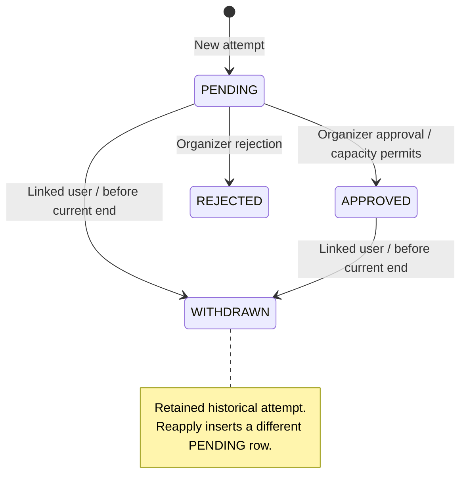

# Event Flow Domain Model

This is the authoritative description of the implemented domain semantics and
invariants. [PRODUCT.md](PRODUCT.md) describes user-facing capabilities; exact
storage definitions are in [prisma/schema.prisma](prisma/schema.prisma). Code
references below identify enforcement points. An intentional change to an
invariant must update this document with its implementation.

## 1. Identity

Email verification uses a single current, one-use delivery token per User in
the existing Verification table, addressed by the exact namespaced identifier
`event-flow:email-verification:<userId>`, with an independent row ID.
Only a SHA-256 digest of the delivery token is stored. A random nonce distinguishes
deliveries even when Better Auth issues identical JWTs within one second.
Delivery holds a User row lock and deletes/recreates this exact slot
transactionally; SMTP failure rolls back the replacement.
SMTP acceptance and database commit are not
a distributed transaction: a commit failure after acceptance can leave the newly
delivered link unusable, requiring resend.

The `/verify-email` before hook atomically deletes the matching, unexpired digest
before passing the original JWT to Better Auth for signature/expiry validation,
email confirmation, and automatic sign-in. Concurrent clicks have one winner;
revoked, consumed, expired, and legacy untracked links fail closed. A failure
after consumption requires resend. An already accepted verification request may
finish while a subsequent resend is in progress; resend cannot undo that request.
The one-hour expiry and contextual return destination remain unchanged.

Source: [verification delivery and consumption](lib/email-verification.ts),
[Better Auth hooks](lib/auth.ts).

`User` is the single Event Flow identity. `OrganizerProfile` is an optional,
one-per-User organizer capability. There is no Attendee, GuestProfile,
AttendeeProfile, User.role, or isOrganizer domain field/entity.

Registration, sign-in, GET `/dashboard`, and GET `/onboarding/organizer` do not
create profiles. The verified-user `becomeOrganizer` action is the only current
activation path; `ensureOrganizerProfile` is idempotent through unique userId and
skipDuplicates. `/account` belongs to the User; `/dashboard` requires the
OrganizerProfile. REQUIRED registration requires a verified User, not a profile.

Sources: [activation](app/(application)/onboarding/organizer/actions.ts),
[organizer guard](features/organizer/server/require-organizer.ts),
[session guards](lib/session.ts).

## 2. Event workspace

`Event` and its `RegistrationForm`, fields, and options are mutable organizer
workspace. Event creation also creates an empty registration form. Workspace
edits increment contentVersion; version checks reject conflicting edits.
Unpublished changes are visible to the organizer and Preview, not public content.

Dates are stored as instants with an IANA timezone for input/display. Authoring
rejects ambiguous/nonexistent local DST times. Event end must be after start.

Sources: [create](features/events/create-event.ts),
[edit](features/events/update-event.ts),
[form mutations](features/events/server/registration-form.ts),
[date validation](features/events/event-input-schema.ts).

## 3. Publication

`publishOwnedEvent` locks the owned Event, checks the requested contentVersion,
builds a snapshot, creates a new EventRevision, and changes publishedRevisionId
atomically. Publishing the already-current contentVersion succeeds without
creating another revision. Older revisions are not rewritten by application code.

The first publication generates a separate UUIDv7 publicId via PostgreSQL
`uuidv7()` and assigns the first publishedAt. publicId is stored as `uuid`.
Republishing preserves them and the workspace updatedAt token. Revision numbers
increase per Event. A never-published Event has a null current pointer: create
Event first, create its revision second, set the pointer third. There is no
impossible insert cycle.

The composite FK `(Event.id, publishedRevisionId) -> EventRevision(eventId, id)`
ensures that the current publication belongs to the same Event. Its DELETE and
UPDATE actions are RESTRICT; it does not null or rewrite Event.id. The nullable
pointer can be explicitly cleared at the storage level, but there is no product
unpublish flow.

Sources: [publisher](features/events/server/publish-event.ts),
[public reader](features/events/server/get-published-event.ts).

## 4. Snapshot contracts

All current snapshots have `schemaVersion: 1`. Responsibilities are separate:

| Contract | Responsibility | Implementation |
| --- | --- | --- |
| Current authoring | Validate mutable questions/options | [registrationFieldSchema](features/events/schemas/registration-form.ts) |
| Historical v1 | Read the frozen serialized format independently of authoring | [eventSnapshotSchema](features/events/schemas/event-snapshot.ts) |
| Current publication | Require valid v1 plus current authoring/publication rules | [eventPublicationSnapshotSchema](features/events/schemas/event-publication-snapshot.ts) |

V1 contains event content, schedule/timezone, visibility, account requirement,
capacity, registration dates, and ordered fields/options. Each field retains id,
type, label, description, required, and options; options retain id and label.
Array order expresses display order. Historical field constraints are defined
locally in the v1 parser, without runtime imports of mutable authoring validation.
Future authoring changes must not silently redefine that compatibility contract.

`buildEventSnapshot` constructs v1 from workspace and applies the current
publication validator, also for Preview. New publication forbids registration
opens/closes after event end. Historical v1 still reads older snapshots containing
a later close time; effective availability caps it at end.

Public Event, metadata, catalog, historical detail, prefill, and policy consumers
use validated historical snapshots. Invalid snapshots fail closed or produce an
unavailable state; they never fall back to mutable form/content.

## 5. Visibility

PUBLIC is reachable by direct URL and discoverable in `/e`. PRIVATE is reachable
by direct URL, excluded from `/e`, and marked noindex/nofollow. PRIVATE is not
password protection or an access-control boundary.

Catalog eligibility uses current snapshot.visibility and requires a publicId and
valid published revision. Upcoming means startsAt > now; Happening now means
startsAt <= now < endsAt; Past means endsAt <= now. Content and classification
never use workspace values. Organizer dashboard filters do use workspace visibility.

Sources: [catalog query](features/events/server/get-public-events.ts),
[catalog page](app/e/page.tsx), [Public Event](app/e/[publicId]/page.tsx).

## 6. Registration availability

The shared [registrationAvailability](features/events/registration-availability.ts)
uses:

```text
effectiveDeadline = min(registrationClosesAt, endsAt), if close is configured
                    endsAt, otherwise
now >= effectiveDeadline               => CLOSED
now < registrationOpensAt, if configured => NOT_OPEN_YET
otherwise                              => OPEN
```

Closed is checked before opening. startsAt does not close registration; event end
always does. UI computes at render time. Submit checks current published dates
under the Event lock and immediately before insert, using server time.

## 7. Current policy vs historical form

**Submitted revision answers: "What did the applicant answer?"** It controls
fields, types, labels/options, required answers, answer validation, historical
meaning, and the saved Application.eventRevisionId. It must belong to the Event
resolved through publicId, but need not still be current for an ordinary submission.

**Current publication answers: "May this applicant submit now?"** It controls
registration availability, effective deadline, and accountRequirement. Ownership
is checked against the current Event -> OrganizerProfile -> User relation.

`submitEventApplication` resolves identity server-side, validates historical
answers, obtains Event FOR UPDATE, rereads publication and owner, then checks
current admission policy. New applications and nested answers/options are atomic.
The client cannot supply an authoritative userId or override a verified user's email.

For OPTIONAL -> REQUIRED, anonymous submission of an old OPTIONAL form fails;
a verified User may still submit it. For REQUIRED -> OPTIONAL, the old REQUIRED
flag does not itself block an anonymous submission. Other guards still apply.
Linked reapplication additionally requires the current form (section 12).

If Publish gets the lock first, Submit uses the new policy. If Submit gets it
first, it may commit under the old policy before Publish. Neither order changes
the submitted form contract.

Source: [submission](features/events/server/submit-application.ts).

## 8. Application

An Application is one historical submission attempt, not the person's mutable
registration record. Its submitted payload is eventRevisionId, fullName, email,
answers, and selected option IDs. Its lifecycle state is status, reviewedAt, and
withdrawnAt. userId is a nullable identity link, not a replacement for historical
name/email. Verified sessions supply userId/email; names remain applicant input.
Emails are trimmed and lowercased by submission code.

New attempts start PENDING. Review and withdrawal preserve payload and explicitly
preserve updatedAt; reviewedAt/withdrawnAt record those lifecycle changes. Removing
a linked User sets userId null while retaining submission data, provided other
User relations do not prevent that deletion.

Organizer All/status counts count Application rows, not distinct applicants.
Public Event selects the linked non-WITHDRAWN application first. If none exists,
it may show the latest withdrawn attempt for reapplication; it is not a full
history screen. Anonymous records are not selected by matching session email.

### My Registrations read model

The verified User workspace reads only `Application.userId = session.user.id`;
anonymous applications are never claimed through matching email. The overview
groups attempts by Event: the non-WITHDRAWN linked attempt is current (including
blocking REJECTED), otherwise the latest WITHDRAWN by createdAt DESC, id DESC is
selected. PRIVATE events and historical owner applications follow the same rules.
Cards use only validated current published snapshots and publicId. Missing or
invalid publication is omitted, without workspace fallback. Historical answers
still belong to the submitted revision. Upcoming means endsAt > now (including
ongoing events), sorted by startsAt ASC; Past means endsAt <= now, sorted by
endsAt DESC. Both use publicId ASC as deterministic tie-breaker.

Registration detail at `/account/registrations/[eventId]` reads all attempts with
both `Application.userId = session.user.id` and the route Event ID. Malformed,
missing, and foreign IDs reveal no applications. Current selection is unchanged;
all other attempts appear newest-first by createdAt DESC, id DESC. Each attempt's
identity and answers retain their submitted meaning through its own validated
`EventRevision.snapshot`, using the shared historical answer interpreter. No
mutable form or email ownership is involved. PRIVATE linked events are included.
The page presents validated current published event content when available;
otherwise it uses the current attempt's validated submitted revision, or an
unavailable context if that snapshot is invalid. Neither path reads workspace
content. View event is shown only for a safe current publication/publicId.
The existing attendee SSE invalidation refreshes detail without new mutations.

Sources: [attendee overview](features/events/server/get-my-registrations.ts),
[attendee detail](features/events/server/get-my-registration.ts).

## 9. Application lifecycle



REJECTED is terminal and blocks another attempt for the same email/userId.
WITHDRAWN never transitions back to PENDING. Repeating withdrawal of an already
WITHDRAWN own application returns success without changing it, including after end.
Review accepts only PENDING, writes reviewedAt, and uses a conditional update.
Withdrawal writes withdrawnAt and retains any previous reviewedAt.

Sources: [review](features/events/server/review-application.ts),
[withdrawal](features/events/server/withdraw-application.ts).

## 10. Application uniqueness / attempts

PostgreSQL enforces partial unique indexes on `(eventId, email)` and
`(eventId, userId)` with this predicate:

```sql
WHERE status IN ('PENDING', 'APPROVED', 'REJECTED')
```

These three statuses are active **for uniqueness/current-attempt selection**.
REJECTED is blocking despite being terminal. WITHDRAWN is excluded; multiple
withdrawn attempts for one identity are permitted. Multiple null userId values
are allowed; anonymous attempts still participate in email uniqueness. SQL email
uniqueness is on stored text; normalization is a server responsibility.

Duplicate violations of either named index return the same success as a new
submission without exposing the existing record. They do not update or claim it.
This is identity-key uniqueness, not a guarantee about a physical person using
another email/account. There is no shared active-status helper; Public Event's
`not WITHDRAWN` currently matches the explicit SQL predicate for the current enum.

## 11. Capacity

Capacity comes from the current published snapshot; null means unlimited.
Only APPROVED attempts occupy places, across all submitted revisions of the Event.
PENDING, REJECTED, and WITHDRAWN do not. Finite-capacity UI uses:

```text
filled = count(APPROVED for Event)
available = max(0, capacity - filled)
```

Submit and reapply may create PENDING even when full. Approve locks Event, reads
current capacity, counts approved applications, and refuses approval when full.
APPROVED -> WITHDRAWN releases a place. Publishing a lower capacity may make the
Event over capacity without demoting existing approvals. Later approvals remain
blocked until space exists. Concurrent approvals cannot independently take the
same final slot through the current server flow.

Sources: [review](features/events/server/review-application.ts),
[capacity UI](features/events/components/application-capacity.tsx).

## 12. Withdrawal and reapplication

The withdrawal action requires a verified User. The server finds the application
by id + Event + that userId, permits PENDING/APPROVED, and requires now < the
current published endsAt. It does not use the submitted revision's end or the
registration close. REJECTED cannot be withdrawn. No payload/answers are deleted.

Reapply uses Submit and inserts a new PENDING attempt. For a verified User with
any prior WITHDRAWN attempt on that Event, the submitted revision must equal the
current pointer under lock. An intervening publication requires reloading the
form. Current admission/owner guards and partial uniqueness still apply.

Public Event chooses the latest withdrawn attempt by createdAt DESC, id DESC only
when no linked active attempt exists and the user is not the owner. Prefill uses
its fullName, current verified account email, and answers only when the field ID
and complete parsed field definition match. Options must retain their IDs, labels,
and order. Changed/deleted fields do not carry answers; new required fields must
be answered. Workspace option replacement can invalidate choice prefill even if
labels look unchanged. The previous attempt remains untouched.

There is no anonymous withdrawal/claiming extension. The extra current-revision
reapply check is keyed by verified userId, not anonymous email; ordinary anonymous
submission still follows section 7.

Sources: [Public Event](app/e/[publicId]/page.tsx),
[prefill](features/events/application-prefill.ts),
[withdraw action](features/events/withdraw-application-action.ts).

## 13. Historical answers

Application detail resolves labels/options exclusively through
`Application.eventRevision.snapshot`. fieldId/optionId are historical snapshot
identifiers, not foreign keys to mutable RegistrationField/RegistrationFieldOption.
Deleting or editing workspace questions cannot delete or reinterpret submitted
answers. Malformed/unresolvable historical data produces an unavailable state.
The same detail component serves the full page and modal.

Organizer header title/timezone may reflect workspace; that does not replace the
historical answer contract. Sources: [resolver](features/events/historical-answers.ts),
[detail](features/events/components/application-detail.tsx).

## 14. Ownership

Organizer routes/actions require a verified User and OrganizerProfile. Owned Event
lookups and mutations constrain organizerId server-side. Review verifies Event
ownership while taking the lock. Withdrawal verifies the application's linked
userId; knowledge of publicId or matching email alone is insufficient.

Authenticated Event owners cannot create a new application on their own Event:
Submit compares session.user.id with Event.organizer.userId before and after the
lock. Historical owner applications are not removed and may still be withdrawn
when eligible. OPTIONAL anonymous submissions cannot provide an absolute
physical-person owner guarantee.

## 15. Concurrency

Event is the serialization boundary for Publish, Submit, Approve, Reject, Withdraw,
and Reapply through Submit. These mutations use **ReadCommitted + explicit Event
FOR UPDATE**, not SERIALIZABLE. Publish/review share `lockEventForUpdate`;
Submit/Withdraw lock the same row using their public context. Form editing locks
Event before the form; Event updates obtain a write lock and use version conditions.

Review conditionally updates PENDING. Withdrawal conditionally updates own
PENDING/APPROVED. Unique indexes remain the final concurrent-insert protection.
If Approve precedes Withdraw, both may succeed and end WITHDRAWN. If Withdraw
precedes review, review refuses the non-PENDING row. Reject first blocks withdrawal;
Withdraw first prevents that rejection and allows a new attempt. Publish and
Approve use lock order to choose capacity; a later Publish can lower the limit.

Organizer application list/detail reads use RepeatableRead. Public reads are not
one multi-query transaction and can briefly be stale. Mutation guards remain
authoritative.

Sources: [lock helper](features/events/server/lock-event-for-update.ts),
[organizer reads](features/events/server/organizer-applications.ts).

## 16. Database invariants

PostgreSQL enforces the following independently of UI/server guards:

| Guarantee | Constraint/relation |
| --- | --- |
| Unique User email and one profile per User | User email and OrganizerProfile.userId unique indexes |
| Current revision belongs to its Event | Event `(id, publishedRevisionId)` -> EventRevision `(eventId, id)` |
| Submitted revision belongs to its Event | Application `(eventId, eventRevisionId)` -> EventRevision `(eventId, id)` |
| At most one active attempt per event/email or non-null userId | Partial indexes from section 10 |
| At most one answer per application/field | Unique `(applicationId, fieldId)` |
| No duplicate selected option within an answer | Primary key `(answerId, optionId)` |
| Unique publication identity/version | Event publicId and publishedRevisionId; EventRevision `(eventId, number)` and `(eventId, contentVersion)` |
| Unique form/order slots | RegistrationForm.eventId; field `(formId, position)`; option `(fieldId, position)` |

Foreign-key actions:

| Referencing -> referenced relation | ON DELETE | ON UPDATE |
| --- | --- | --- |
| OrganizerProfile -> User; Event -> OrganizerProfile | RESTRICT | CASCADE |
| Event current pointer -> EventRevision | RESTRICT | RESTRICT |
| EventRevision -> Event | RESTRICT | CASCADE |
| Application -> Event and composite EventRevision | RESTRICT | CASCADE |
| Application.userId -> User | SET NULL | CASCADE |
| Session / Account -> User | CASCADE | CASCADE |
| RegistrationForm -> Event; Field -> Form; Option -> Field | CASCADE | CASCADE |
| ApplicationAnswer -> Application; AnswerOption -> Answer | CASCADE | CASCADE |

Domain timestamps use timestamptz(3) on Event, EventRevision, registration workspace,
and Application. Auth tables and OrganizerProfile use timestamp(3) without time
zone. Answers/options have no timestamp columns. Internal primary keys, foreign
keys, and historical field/option references use PostgreSQL `uuid`, except for
the Better Auth infrastructure table Verification. Its ID remains text-compatible
to support Better Auth-owned identifiers; ordinary Prisma-created rows still get
the `uuid(7)` default. All other internal entity IDs remain native PostgreSQL UUID
with UUIDv7 generation. Our email-verification slot uses a namespaced identifier,
not its row ID. Provider `Account.accountId`/`providerId`, tokens,
and verification identifiers remain text. Snapshot v1 identifiers remain strings;
new snapshots contain UUIDs without changing the frozen historical parser.
Prisma manages internal generated IDs and updatedAt; these are not database-generated
defaults/triggers. The publisher explicitly generates publicId in PostgreSQL.

Server code, not DB CHECK constraints/triggers, enforces snapshot validity,
immutability of published/submitted content, lifecycle transitions, capacity,
current admission policy, verified identity, owner restrictions, explicit organizer
activation, and PUBLIC catalog filtering. Capacity safety depends on the shared
locking protocol; the DB does not impose an aggregate capacity constraint.

## 17. Application realtime

PostgreSQL and the existing server read models remain authoritative. SSE carries
only `connected` and `invalidate` events with empty JSON objects, plus comment
heartbeats; no application data, PII, or internal routing IDs reach the browser.
The client coalesces signals and calls `router.refresh()` without maintaining a
second application read model.

Submit/reapply, approve/reject, and withdrawal emit `pg_notify` inside the same
transaction after an actual write. Duplicate, no-op, and error paths do not emit.
The internal envelope contains only type, Event ID, and nullable linked User ID.
Anonymous submissions invalidate only organizer subscribers; linked changes also
invalidate that User's subscribers. Event editing/publication does not emit.

NOTIFY becomes visible only after successful commit; rollback delivers nothing.
Transactional NOTIFY or commit failure may roll back the entire mutation: this
is an accepted trade-off. After commit, listener/broker/SSE/browser failures do
not change the committed domain state. LISTEN/NOTIFY is ephemeral with no replay,
outbox, or durable event log. Initial LISTEN readiness and listener/browser
reconnection produce `connected`, prompting authoritative refresh to resync.

A lazy global singleton owns at most one dedicated LISTEN connection per Node
process/runtime context, separate from the Prisma pool. Each instance fans out
locally to authorized Event/User subscribers. Reconnect repeats LISTEN; the
broker retains no missed notifications. Slow streams are closed rather than
accumulating an unbounded queue.

Organizer streams require a verified User, OrganizerProfile, and owned Event;
malformed, foreign, and missing Event IDs share a neutral 404. Attendee routing
uses only the verified authoritative session User ID. Every request rechecks
authorization without refreshing the session. Stream lifetime is limited to
the earlier of 60 seconds from the session check and session expiry. Native
EventSource reconnect reauthorizes; an accepted revocation window of up to 60
seconds replaces session polling. Streams are private/no-store and heartbeat
approximately every 15 seconds. Abort, cancel, deadline, and failed writes remove
the subscriber and timers.

Deployment assumes persistent Node.js processes, session-preserving PostgreSQL
connections for LISTEN, and HTTP streaming without proxy buffering. Short-lived
serverless runtimes are not assumed to support this lifecycle. Broker dispose
is available without installing process signal handlers.

Sources: [emission](lib/realtime/application-notifications.ts),
[broker](lib/realtime/application-broker.ts),
[stream lifecycle](lib/realtime/sse-response.ts).

## 18. Transactional application email

Each committed new Application (including reapply) creates APPLICATION_RECEIVED
for its historical Application.email and NEW_APPLICATION for the organizer's
User.email. Actual PENDING -> APPROVED/REJECTED transitions create the matching
applicant notification. Mutation, EmailOutbox rows, and wake-up NOTIFY share the
same transaction. Duplicate/no-op/error paths create no delivery intent; rollback
removes both mutation and outbox. Withdrawal creates no email.

EmailOutbox has no Event/Application foreign keys. Its unique deduplicationKey is
Application.id + purpose. Recipient and versioned schemaVersion=1 JSON payload
are immutable delivery snapshots. They contain only the fields needed by that
email, not answers, rendered HTML/subject, or an absolute hostname. Separate Zod
contracts validate each type on creation and again before rendering. Received,
organizer, and approval emails snapshot the current published event under the
Event lock, never mutable workspace content. Render constructs absolute links
from the server app origin.

Rejection is deliberately independent of current publication/publicId. It uses
the submitted EventRevision's historical title when readable and the Event's
safe publicId when available. Otherwise it omits the title/link; the renderer
supports no CTA. Damaged historical JSON must not add a Reject precondition.
No rejection reason, workspace fallback, or new domain decision is introduced.

A short ReadCommitted transaction claims up to five due rows using a single
CTE SELECT FOR UPDATE SKIP LOCKED + UPDATE RETURNING. Due means PENDING with
nextAttemptAt <= DB now, or PROCESSING with a five-minute expired lease. Claim
sets lockedAt/lockedBy and increments attempts. Concurrent Node processes skip
each other's locks. SMTP starts only after commit, in parallel within the bounded
batch, with a 45-second socket-closing delivery deadline and shorter connection,
greeting, and idle timeouts. No domain or claim transaction spans SMTP.

Every success/retry/failure update predicates on id, PROCESSING, workerId, and
the claimed attempts value. Zero affected rows means lost ownership and causes
no further write. Attempts never reset. Failure after attempts 1/2/3/4 schedules
1 minute / 5 minutes / 30 minutes / 2 hours; attempt 5 becomes terminal FAILED
with nextAttemptAt null. An expired fifth claim also becomes FAILED under the
claim row lock without a sixth send. Retry clears locks; success writes SENT and
sentAt and clears due time, locks, and error. Errors are fixed bounded categories,
never raw SMTP responses, addresses, payloads, or credentials. SENT/FAILED are
excluded from automatic claims. An unacknowledged DB completion uses lease recovery.

Delivery is at-least-once, subject to the five-attempt limit: SMTP acceptance and
the SENT update are not atomic. Crash/lease recovery can duplicate a delivered
email. Ownership protects database state, not exactly-once SMTP delivery.

Next.js Node instrumentation starts a global/HMR-safe process singleton, with one
dispatcher loop and a dedicated LISTEN connection on event_flow_email_outbox,
separate from SSE. Startup, listener readiness/reconnect, and each 30-second sweep
query the durable queue. NOTIFY only wakes that loop; lost notifications cannot
lose intents. A running loop coalesces wake-ups. Disposal stops reconnect/timers,
closes the listener, and awaits in-flight delivery. The dispatcher makes no domain
decisions. Persistent Node runtimes remain required, as for realtime; there is
no separate Docker worker, generic bus, Redis, or leader election.

Sources: [creation](lib/email-outbox/enqueue.ts),
[contracts](lib/email-outbox/payload.ts), [delivery](lib/email-outbox/delivery.ts),
[dispatcher](lib/email-outbox/dispatcher.ts), [startup](instrumentation.ts).

## 19. Deliberate trade-offs

- EventRevision immutability is enforced by application code, not a DB trigger.
- Anonymous identity is weaker than authenticated identity. Anonymous submissions
  are not claimed by a User just because email matches.
- A full Event accepts PENDING attempts. Republish may lower capacity below the
  approved count while preserving approvals.
- Public UI can briefly be stale; authoritative mutations recheck conditions.

These are current boundaries, not a roadmap. The initial migration is a deliberate
pre-production development baseline; replacing applied migration history is not
a deployment strategy for a database containing persistent production data.
